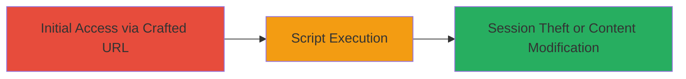

---
tags:
  - xss
  - reflected-xss
  - web-vulnerability
  - dod
  - javascript-injection
type: attack_chain
tools: []
tactics:
  - '[[Execution]]'
  - '[[Collection]]'
commands: []
platforms:
  - Web
complexity: low
procedures:
  - '[[procedures/Exploit-Reflected-XSS-via-Malicious-URL]]'
step_count: 1
techniques:
  - '[[JavaScript]]'
description: >-
  A single-stage attack exploiting a reflected XSS vulnerability on a U.S.
  Department of Defense website by injecting a malicious JavaScript payload via
  a crafted URL, enabling script execution to steal session information or
  modify content.
skill_level: beginner
impact_level: high
id: 278da1e9-9ab3-4f70-8197-e37cccdec5bd
created_at: '2025-12-14T03:16:25.244Z'
updated_at: '2025-12-14T03:16:25.244Z'
verified: false
validated: true
submitted: true
mitre_tactics:
  - '[[Execution]]'
  - '[[Collection]]'
mitre_techniques:
  - '[[JavaScript]]'
---
# Reflected XSS on DoD Website to Execute Malicious JavaScript

Multi-stage attack chain demonstrating a complete attack workflow.

## Chain Metrics Dashboard

| Metric | Value |
|--------|-------|
| Chain Status | Unverified |
| Total Steps | 1 |
| Execution Time | ~1 minutes |
| Skill Level | Beginner |
| Complexity | Low |
| Impact Level | High |

## Attack Flow Visualization

## Prerequisites & Requirements

### Required Tools

- None (manual URL crafting)

### Target Environment

- Web platform
- Publicly accessible DoD website with vulnerable URL parameter
- No specific services/ports required beyond HTTP/HTTPS

### Initial Access Requirements

- Internet access to the target website
- No credentials needed
- Direct network access to the public-facing site

## Detailed Attack Procedures

### Step 1: Exploit Reflected XSS
procedure: [[procedures/Exploit-Reflected-XSS-via-Malicious-URL]]

**Objective**: Inject a malicious JavaScript payload into a URL parameter to trigger reflected XSS, executing arbitrary scripts in the victim's browser to steal session data or alter page content.

**Instructions**: Craft a malicious URL by appending the payload to a vulnerable query parameter on the DoD website. For example, if the vulnerable endpoint is `https://example.dod.mil/search?q=`, modify it to include the payload. Open the URL in a browser to trigger the injection.

The payload used is: `'>12345"+onfocus=alert(document.domain)+autofocus`

Full example URL: `https://example.dod.mil/search?q='>12345"+onfocus=alert(document.domain)+autofocus`

**Expected Output**: Upon loading the page, a JavaScript alert box pops up displaying the document domain (e.g., the DoD site's domain), confirming successful script execution.

**Success Indicators**:
- Alert dialog appears with the domain name
- Browser console shows no errors, and the injected script runs
- Potential for further payloads to exfiltrate cookies or session tokens via network requests

## Attack Chain Summary

### Key Achievements

1. Successful injection and execution of JavaScript on a high-value DoD target
2. Demonstration of session information exposure risk
3. Highlight of content modification potential for phishing or defacement

## Technique & Tactic Coverage

### MITRE ATT&CK Techniques

- [[JavaScript]]

### MITRE ATT&CK Tactics

- [[Execution]]
- [[Collection]]

---
*Last updated: 2023-10-01T00:00:00Z*
