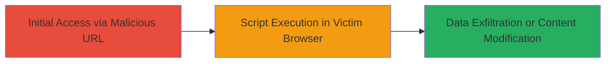

# Reflected XSS on DoD Website to Execute Malicious Scripts and Steal Session Data

Multi-stage attack chain demonstrating a complete attack workflow.

## Chain Metrics Dashboard

| Metric | Value |
|--------|-------|
| Chain Status | Unverified |
| Total Steps | 1 |
| Execution Time | ~1 minutes |
| Skill Level | Intermediate |
| Complexity | Medium |
| Impact Level | High |

## Attack Flow Visualization

## Prerequisites & Requirements

### Required Tools

- Browser developer tools for payload testing

### Target Environment

- Web platform
- Publicly accessible DoD website with reflected input fields (e.g., search or query parameters)
- No specific ports or services required beyond HTTP/HTTPS

### Initial Access Requirements

- No credentials needed
- Internet access to the target website
- Ability to distribute the malicious URL (e.g., via phishing or social engineering)

## Detailed Attack Procedures

### Step 1: Craft and Deliver Malicious URL
procedure: [[procedures/Craft-Malicious-URL-for-Reflected-XSS]]

**Objective**: Identify a reflected input point on the DoD website and craft a URL that injects a malicious JavaScript payload, tricking the victim into executing it upon page load to steal session data or alter content.

**Instructions**: Inspect the website for parameters that reflect user input without sanitization, such as search queries. Append a payload like `` to the URL parameter. For example, if the vulnerable endpoint is `https://example-dod-site.gov/search?q=`, the malicious URL becomes `https://example-dod-site.gov/search?q=`. Send this URL to the victim via email or link. Upon clicking, the script executes in their browser.

**Expected Output**: The victim's browser executes the script, displaying an alert with session cookies or sending data to an attacker-controlled server.

**Success Indicators**:
- Script execution confirmed (e.g., alert pops up)
- Session cookies captured or page content modified
- No server-side errors blocking reflection

## Attack Chain Summary

### Key Achievements

1. Successful injection of malicious script via reflected URL parameter
2. Execution of JavaScript in victim's browser context
3. Potential theft of sensitive session information from a DoD website

## Technique & Tactic Coverage

### MITRE ATT&CK Techniques

- [[Drive-by Compromise]]
- [[JavaScript]]

### MITRE ATT&CK Tactics

- [[Initial Access]]
- [[Execution]]
- [[Collection]]

---
*Last updated: 2023-10-01T00:00:00Z*
