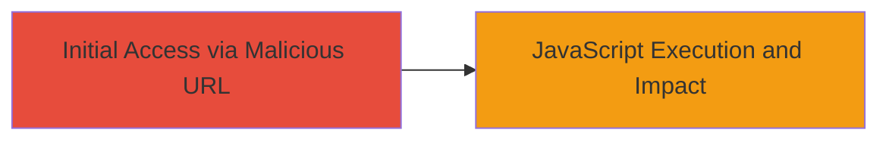

---
tags:
  - xss
  - reflected-xss
  - javascript
  - web-vulnerability
type: attack_chain
tools: []
tactics:
  - '[[Initial Access]]'
  - '[[Execution]]'
  - '[[Collection]]'
verified: false
platforms:
  - Web
submitted: true
created_at: '2023-10-01T00:00:00Z'
procedures:
  - '[[procedures/Exploit-Reflected-XSS-via-Error-Parameter]]'
step_count: 1
techniques:
  - '[[Exploit Public-Facing Application]]'
  - '[[JavaScript]]'
updated_at: '2025-12-13T23:52:38.919Z'
description: >-
  A single-stage attack exploiting a reflected XSS vulnerability in the error
  query parameter of a login page to execute arbitrary JavaScript in the
  victim's browser.
id: cc2f3b25-3109-4428-b5bf-6885a4564095
validated: true
mitre_tactics:
  - '[[Initial Access]]'
  - '[[Execution]]'
  - '[[Collection]]'
mitre_techniques:
  - '[[Exploit Public-Facing Application]]'
  - '[[JavaScript]]'
---
# Reflected XSS on Login Page Error Parameter for JavaScript Execution

Multi-stage attack chain demonstrating a complete attack workflow.

## Chain Metrics Dashboard

| Metric | Value |
|--------|-------|
| Chain Status | Unverified |
| Total Steps | 1 |
| Execution Time | ~1 minutes |
| Skill Level | Intermediate |
| Complexity | Medium |
| Impact Level | High |

## Attack Flow Visualization



## Prerequisites & Requirements

### Required Tools

- Browser developer tools for payload testing

### Target Environment

- Web application with login page
- Vulnerable to reflected XSS in query parameters
- No specific ports or services beyond standard HTTP/HTTPS

### Initial Access Requirements

- Public access to the login page
- No credentials needed for exploitation
- Victim interaction via phishing or direct link

## Detailed Attack Procedures

### Step 1: Inject Malicious Payload into Error Parameter
procedure: [[procedures/Exploit-Reflected-XSS-via-Error-Parameter]]

**Objective**: Deliver a malicious URL to the victim that triggers JavaScript execution upon accessing the login page, allowing theft of session data or other impacts.

**Instructions**: Construct a URL with a JavaScript payload in the 'error' query parameter. For example, use an onerror handler in an image tag to execute code when the page loads and reflects the unsanitized input.

Navigate to the target login URL with the payload:

```url
https://target.com/users/login?error=
```

Replace the alert with more malicious code, such as stealing cookies:

```javascript

```

**Expected Output**: The error message on the page renders the payload, executing the JavaScript in the context of the victim's browser, popping an alert or sending data to the attacker.

**Success Indicators**:
- JavaScript alert or network request to attacker server
- Reflection of payload in the page source without encoding
- Ability to execute arbitrary code like cookie exfiltration

## Attack Chain Summary

### Key Achievements

1. Successful injection and reflection of XSS payload in the login error message
2. Arbitrary JavaScript execution enabling session hijacking and data theft
3. Demonstration of high-impact effects like website defacement or phishing redirection

## Technique & Tactic Coverage

### MITRE ATT&CK Techniques

- [[Exploit Public-Facing Application]]
- [[JavaScript]]

### MITRE ATT&CK Tactics

- [[Initial Access]]
- [[Execution]]
- [[Collection]]

---
*Last updated: 2023-10-01T00:00:00Z*
