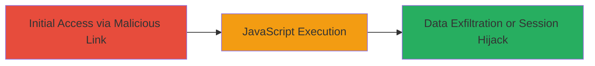

# Reflected XSS on Max Payne 3 Sub-site Leading to Arbitrary JavaScript Execution

Multi-stage attack chain demonstrating a complete attack workflow.

## Chain Metrics Dashboard

| Metric | Value |
|--------|-------|
| Chain Status | Unverified |
| Total Steps | 1 |
| Execution Time | ~1 minutes |
| Skill Level | Intermediate |
| Complexity | Medium |
| Impact Level | High |

## Attack Flow Visualization



## Prerequisites & Requirements

### Required Tools

- Browser with developer tools (e.g., Chrome DevTools)

### Target Environment

- Web platform
- Public-facing website (rockstargames.com Max Payne 3 sub-site)
- No specific ports or services required beyond HTTP/HTTPS

### Initial Access Requirements

- Ability to send a malicious link to a victim (e.g., via phishing)
- No prior credentials needed
- Network access to the internet

## Detailed Attack Procedures

### Step 1: Exploit Reflected XSS
procedure: [[procedures/Exploit-Reflected-XSS-Vulnerability]]

**Objective**: Inject a malicious script payload into a vulnerable URL parameter on the Max Payne 3 sub-site, causing the victim's browser to execute arbitrary JavaScript upon visiting the crafted URL.

**Instructions**: Identify a reflected input field or search parameter on the sub-site (e.g., a query string like ?q=). Craft a URL with a JavaScript payload such as <script>alert('XSS')</script> encoded if necessary. Send the link to the victim or test directly in your browser. Upon execution, the script runs in the context of the site, allowing access to cookies, local storage, or DOM manipulation.

For testing, use a browser to navigate to the vulnerable endpoint and append the payload:

```url
https://socialclub.rockstargames.com/mp3?q=<script>alert(document.cookie)</script>
```

Observe the alert popping up with cookie data to confirm execution.

**Expected Output**: Execution of the injected script, such as an alert box displaying sensitive data like session cookies.

**Success Indicators**:
- Alert or other script behavior triggers in the browser
- Access to victim-specific data (e.g., cookies) is obtained
- No server-side sanitization blocks the payload

## Attack Chain Summary

### Key Achievements

1. Successful injection and reflection of malicious JavaScript on a public-facing sub-site
2. Demonstration of potential for session hijacking or phishing via stolen cookies
3. Identification of insufficient input sanitization as the root cause

## Technique & Tactic Coverage

### MITRE ATT&CK Techniques

- [[Exploit Public-Facing Application]]
- [[JavaScript]]

### MITRE ATT&CK Tactics

- [[Initial Access]]
- [[Execution]]

---
*Last updated: 2023-10-01T00:00:00Z*
