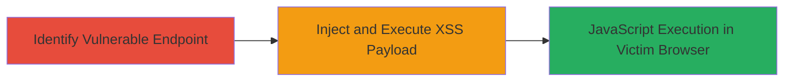

---
tags:
  - xss
  - reflected-xss
  - javascript-injection
  - web-vulnerability
type: attack_chain
tools: []
tactics:
  - '[[Execution]]'
verified: false
platforms:
  - Web
submitted: true
complexity: low
created_at: '2023-10-01T00:00:00Z'
procedures:
  - '[[procedures/Inject-Reflected-XSS-Payload-into-Help-Questions]]'
step_count: 1
techniques:
  - '[[Exploit Public-Facing Application]]'
  - '[[JavaScript]]'
updated_at: '2025-12-14T03:15:41.107Z'
description: >-
  A simple reflected cross-site scripting attack exploiting unsanitized input on
  the Simperium help questions page to execute arbitrary JavaScript in victims'
  browsers.
skill_level: beginner
impact_level: high
id: b467045b-9c1e-4897-aee7-8cbbc240c07e
validated: true
mitre_tactics:
  - '[[Execution]]'
mitre_techniques:
  - '[[Exploit Public-Facing Application]]'
  - '[[JavaScript]]'
---
---
id: 123e4567-e89b-12d3-a456-426614174000
name: Reflected XSS on Simperium Help Questions Page
type: attack_chain
description: A simple reflected cross-site scripting attack exploiting unsanitized input on the Simperium help questions page to execute arbitrary JavaScript in victims' browsers.
verified: false
submitted: false
step_count: 1
created_at: 2023-10-01T00:00:00Z
updated_at: 2023-10-01T00:00:00Z
procedures: [[procedures/Inject-Reflected-XSS-Payload-into-Help-Questions]]
techniques: [[Exploit Public-Facing Application]], [[JavaScript]]
tactics: [[Execution]]
tags: xss, reflected-xss, javascript-injection, web-vulnerability
platforms: Web
tools: []
---

# Reflected XSS on Simperium Help Questions Page

Multi-stage attack chain demonstrating a complete attack workflow.

## Chain Metrics Dashboard

| Metric | Value |
|--------|-------|
| Chain Status | Unverified |
| Total Steps | 1 |
| Execution Time | ~1 minutes |
| Skill Level | Beginner |
| Complexity | Low |
| Impact Level | High |

## Attack Flow Visualization

## Prerequisites & Requirements

### Required Tools

- Web browser (e.g., Chrome, Firefox)

### Target Environment

- Web platform
- Access to https://simperium.com/help/questions/
- No authentication required

### Initial Access Requirements

- Public internet access
- No credentials needed
- Victim must visit the crafted malicious link

## Detailed Attack Procedures

### Step 1: Identify and Exploit XSS Vulnerability
procedure: [[procedures/Inject-Reflected-XSS-Payload-into-Help-Questions]]

**Objective**: Test and exploit the reflected XSS vulnerability by injecting a JavaScript payload into the input field on the help questions page, leading to arbitrary code execution in the victim's browser.

**Instructions**: Navigate to https://simperium.com/help/questions/ in a web browser. Locate the input field for submitting questions or search parameters. Append or inject the following payload into the input: `'>`. Submit the form or load the page with the payload in the URL parameter (e.g., https://simperium.com/help/questions/?q='>). The payload breaks out of the HTML context and triggers the onerror event to execute the prompt.

**Expected Output**: A JavaScript alert box displaying the domain name (e.g., "simperium.com"), confirming successful payload execution.

**Success Indicators**:
- Alert prompt appears in the browser
- No sanitization errors; payload reflects unsanitized

## Attack Chain Summary

### Key Achievements

1. Successful identification of reflected XSS on public-facing web endpoint
2. Execution of arbitrary JavaScript, demonstrating potential for session hijacking or data theft
3. Proof-of-concept alert confirming vulnerability

## Technique & Tactic Coverage

### MITRE ATT&CK Techniques

- [[Exploit Public-Facing Application]]
- [[JavaScript]]

### MITRE ATT&CK Tactics

- [[Execution]]

---
*Last updated: 2023-10-01T00:00:00Z*
