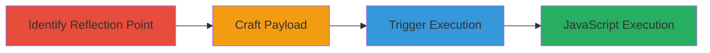

---
tags:
  - xss
  - reflected-xss
  - slack
  - javascript-injection
type: attack_chain
tools: []
tactics:
  - '[[Execution]]'
verified: false
platforms:
  - Web
submitted: true
complexity: medium
created_at: '2023-10-01T00:00:00Z'
procedures:
  - '[[procedures/Identify-Reflection-Point-in-Slack-Sign-in]]'
  - '[[procedures/Craft-XSS-Payload-for-Title-Injection]]'
  - '[[procedures/Trigger-XSS-Execution-via-Malicious-URL]]'
step_count: 3
techniques:
  - '[[JavaScript]]'
updated_at: '2025-12-14T03:15:27.077Z'
description: >-
  A multi-stage attack exploiting a reflected XSS vulnerability in Slack's
  sign-in page by injecting malicious payloads into the page title via
  controllable subdomains or URL parameters, leading to arbitrary JavaScript
  execution.
skill_level: intermediate
impact_level: high
id: 1f8d619f-a79c-4ae1-8cba-bfec35b6de10
validated: true
mitre_tactics:
  - '[[Execution]]'
mitre_techniques:
  - '[[JavaScript]]'
---
# Reflected XSS on Slack Sign-in Page via Subdomain Injection

Multi-stage attack chain demonstrating exploitation of a reflected Cross-Site Scripting (XSS) vulnerability on Slack's sign-in page. The attack leverages user-controlled inputs from workspace subdomains or redirect parameters to inject JavaScript into the page title without proper escaping, resulting in arbitrary code execution in the victim's browser. This can lead to credential theft, session hijacking, or phishing attacks within the sign-in context.

## Chain Metrics Dashboard

| Metric | Value |
|--------|-------|
| Chain Status | Unverified |
| Total Steps | 3 |
| Execution Time | ~5 minutes |
| Skill Level | Intermediate |
| Complexity | Medium |
| Impact Level | High |

## Attack Flow Visualization

## Prerequisites & Requirements

### Required Tools

- Browser developer tools for inspection
- URL crafting tools (e.g., manual or Burp Suite, though none explicitly used)

### Target Environment

- Web platform
- Access to Slack workspace URLs (e.g., https://[subdomain].slack.com)
- No specific ports or services beyond standard HTTPS (443)

### Initial Access Requirements

- No credentials required for public sign-in page access
- Ability to control or guess subdomains (e.g., via registration or typosquatting)
- Network access to load Slack URLs

## Detailed Attack Procedures

### Step 1: Identify Reflection Point
procedure: [[procedures/Identify-Reflection-Point-in-Slack-Sign-in]]

**Objective**: Locate the point where user-controlled input is reflected into the HTML without escaping, specifically in the sign-in page title.

**Instructions**: Navigate to a Slack sign-in page (e.g., https://[subdomain].slack.com/workspace-signin) and inspect the page source. Observe how the subdomain or URL parameters like 'redir' or 'id' are inserted into the <title> tag, such as 'Sign in to [input]'. Test with benign inputs like 'test.slack.com' to confirm reflection.

**Expected Output**: Page title shows reflected input, e.g., 'Sign in to test.slack.com'.

**Success Indicators**:
- Input from subdomain or parameters appears unescaped in the title attribute
- No HTML entity encoding observed in the source

### Step 2: Craft XSS Payload
procedure: [[procedures/Craft-XSS-Payload-for-Title-Injection]]

**Objective**: Develop a payload that closes the title attribute and injects executable JavaScript, exploiting the lack of sanitization.

**Instructions**: Design a payload to break out of the title tag, such as "><svg onload=prompt(document.domain)>. This closes the attribute with "> and injects an SVG element that triggers JavaScript on load. Validate the payload in a local HTML file to ensure it executes without errors.

**Expected Output**: Payload reflected in title as 'Sign in to "><svg onload=prompt(document.domain)>', with potential for execution.

**Success Indicators**:
- Payload breaks out of the attribute context
- JavaScript (e.g., alert or prompt) is parseable in the HTML

### Step 3: Trigger Execution
procedure: [[procedures/Trigger-XSS-Execution-via-Malicious-URL]]

**Objective**: Load the malicious URL in a browser to execute the injected JavaScript, demonstrating code execution on the Slack domain.

**Instructions**: Construct and access a URL like https://sshunter.slack.com/help/requests/793043 with the payload in the subdomain or parameters (e.g., redir=%2Fhelp%2Frequests%2F793043%3Fid%3D%22%3E%3Csvg%20onload%3Dprompt(document.domain)%3E). Load the page in a browser; the onload event should trigger the prompt showing the domain (e.g., sshunter.slack.com).

**Expected Output**: Browser alert/prompt displaying the document domain, confirming JavaScript execution.

**Success Indicators**:
- JavaScript executes in the context of the Slack sign-in page
- No CSP or other protections block the payload

## Attack Chain Summary

### Key Achievements

1. Identified unescaped reflection in page title via subdomain/parameters
2. Injected and executed arbitrary JavaScript on Slack's domain
3. Demonstrated potential for credential theft or phishing in sign-in flow

## Technique & Tactic Coverage

### MITRE ATT&CK Techniques

- [[JavaScript]]

### MITRE ATT&CK Tactics

- [[Execution]]

---
*Last updated: 2023-10-01T00:00:00Z*
