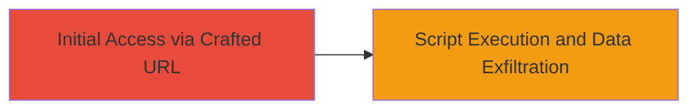

---
tags:
  - xss
  - reflected-xss
  - web-vulnerability
  - script-injection
type: attack_chain
tools: []
tactics:
  - '[[Execution]]'
  - '[[Collection]]'
verified: false
platforms:
  - Web
submitted: true
complexity: low
created_at: '2023-10-01T00:00:00Z'
procedures:
  - '[[procedures/Inject-Malicious-Script-via-Reflected-XSS-in-URL-Parameter]]'
step_count: 1
techniques:
  - '[[JavaScript]]'
updated_at: '2025-12-14T03:16:25.281Z'
description: >-
  A single-stage attack exploiting a reflected XSS vulnerability on a U.S. Navy
  website by injecting malicious scripts via a crafted URL, enabling potential
  theft of sensitive data like cookies.
skill_level: beginner
impact_level: high
id: a77d6239-cb27-4550-ace8-b69dcce4d03c
validated: true
mitre_tactics:
  - '[[Execution]]'
  - '[[Collection]]'
mitre_techniques:
  - '[[JavaScript]]'
---
# Reflected XSS on U.S. Navy Website for Malicious Script Execution

Multi-stage attack chain demonstrating a complete attack workflow.

## Chain Metrics Dashboard

| Metric | Value |
|--------|-------|
| Chain Status | Unverified |
| Total Steps | 1 |
| Execution Time | ~1 minutes |
| Skill Level | Beginner |
| Complexity | Low |
| Impact Level | High |

## Attack Flow Visualization



## Prerequisites & Requirements

### Required Tools

- Web browser (e.g., Chrome with developer tools)

### Target Environment

- Target OS/Platform: Web application
- Required services/ports: HTTP/HTTPS on port 80/443
- Network access requirements: Public internet access to the U.S. Navy website

### Initial Access Requirements

- Credential requirements: None (public-facing site)
- Network position: External attacker
- Prior access needed: None

## Detailed Attack Procedures

### Step 1: Discover and Exploit Reflected XSS
procedure: [[procedures/Inject-Malicious-Script-via-Reflected-XSS-in-URL-Parameter]]

**Objective**: Identify a vulnerable URL parameter and inject a malicious script to execute arbitrary JavaScript in the victim's browser, potentially stealing cookies or modifying page content.

**Instructions**: Access the U.S. Navy website and identify a reflected input field, such as a search parameter. Craft a URL with a payload like `<script>alert(document.cookie)</script>`, URL-encoded as needed (e.g., %3Cscript%3Ealert(document.cookie)%3C%2Fscript%3E). Append it to the vulnerable parameter, for example: `https://navy-site.example.com/search?q=<script>alert(document.cookie)</script>`. Open the URL in a browser to trigger the reflection and execution.

Use [[commands/curl-fetch-xss-payload]] to test via command line if browser access is simulated:

```bash
curl -G "https://navy-site.example.com/search" --data-urlencode "q=<script>alert(document.cookie)</script>"
```

**Expected Output**: The response HTML includes the injected script, which executes when rendered in a browser, popping an alert with cookie data.

**Success Indicators**:
- Malicious script appears unescaped in the page source
- JavaScript executes (e.g., alert box appears)
- Sensitive data like cookies is accessible via the script

## Attack Chain Summary

### Key Achievements

1. Successful injection and reflection of malicious script via URL parameter
2. Demonstration of arbitrary JavaScript execution in the browser context
3. Potential for sensitive information disclosure, such as session cookies

## Technique & Tactic Coverage

### MITRE ATT&CK Techniques

- [[JavaScript]]

### MITRE ATT&CK Tactics

- [[Execution]]
- [[Collection]]

---
*Last updated: 2023-10-01T00:00:00Z*
