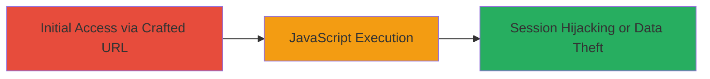

# Reflected XSS on Uber Partners Signup Page Leading to JavaScript Execution

Multi-stage attack chain demonstrating a complete attack workflow.

## Chain Metrics Dashboard

| Metric | Value |
|--------|-------|
| Chain Status | Unverified |
| Total Steps | 1 |
| Execution Time | ~1 minute |
| Skill Level | Beginner |
| Complexity | Low |
| Impact Level | Medium |

## Attack Flow Visualization



## Prerequisites & Requirements

### Required Tools

- [[tools/Firefox]]

### Target Environment

- Web platform
- Access to https://partners.uber.com/signup/global/
- No prior session cookies (fresh browser session)

### Initial Access Requirements

- Public internet access
- No authentication required
- Victim must click a malicious link or access the crafted URL

## Detailed Attack Procedures

### Step 1: Inject Malicious Payload via Location Parameter
procedure: [[procedures/Exploit-Reflected-XSS-via-Location-Parameter]]

**Objective**: Deliver a crafted URL to the victim that injects and executes arbitrary JavaScript in their browser upon accessing the Uber partners signup page.

**Instructions**: Use a fresh browser session without existing cookies. Navigate to the vulnerable endpoint with a payload in the 'location' GET parameter. For example, construct the URL as follows:

```url
https://partners.uber.com/signup/global/?place_id=ChIJPaCKh-tmA4wR7JEkNDrNDSU&location=Carolina <script>alert(1)</script>a%2C+Carolina%22%2C+Puerto+Rico&lat=18.3807819&lng=-65.95738719999997
```

Replace the payload `<script>alert(1)</script>` with more malicious JavaScript, such as code to steal session cookies (e.g., `document.cookie`).

**Expected Output**: The page loads and immediately executes the injected JavaScript, displaying an alert or performing the intended action like logging cookies to a remote server.

**Success Indicators**:
- JavaScript alert or payload execution visible in the browser
- Injected script reflected unsanitized in the page source
- Potential theft of session data in fresh sessions

## Attack Chain Summary

### Key Achievements

1. Successful injection and execution of arbitrary JavaScript via the reflected 'location' parameter.
2. Demonstration of impact including session hijacking in unauthenticated sessions.
3. Identification of lack of input validation on the signup page.

## Technique & Tactic Coverage

### MITRE ATT&CK Techniques

- [[JavaScript]]

### MITRE ATT&CK Tactics

- [[Execution]]
- [[Collection]]

---

*Last updated: 2023-10-01T00:00:00Z*
