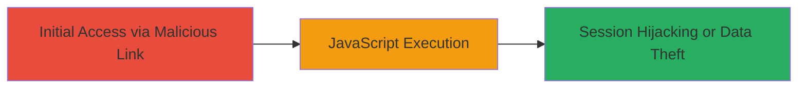

# Reflected XSS on VK.com Search Page for Arbitrary JavaScript Execution

Multi-stage attack chain demonstrating a complete attack workflow.

## Chain Metrics Dashboard

| Metric | Value |
|--------|-------|
| Chain Status | Unverified |
| Total Steps | 1 |
| Execution Time | ~1 minutes |
| Skill Level | Beginner |
| Complexity | Low |
| Impact Level | High |

## Attack Flow Visualization



## Prerequisites & Requirements

### Required Tools

- [[tools/Burp-Suite]]

### Target Environment

- Web platform
- Access to VK.com search page at https://vk.com/search
- No specific ports or services required beyond standard HTTPS (443)

### Initial Access Requirements

- Ability to send a malicious link to the victim (e.g., via email or social engineering)
- Victim must be authenticated or visit the search page
- No prior credentials needed for the attacker

## Detailed Attack Procedures

### Step 1: Deliver and Execute Malicious Search Query
procedure: [[procedures/Exploit-Reflected-XSS-via-Search-Parameter]]

**Objective**: Inject a malicious payload into the search parameter to reflect and execute JavaScript in the victim's browser context.

**Instructions**: Craft a URL with a reflected XSS payload in the search query parameter. For example, use a payload like `<script>alert('XSS')</script>` or more advanced ones for stealing cookies. Deliver the URL to the victim via phishing. Once clicked, the payload executes if the input is not sanitized.

Use [[commands/curl-xss-test]] to verify the vulnerability locally or in a testing environment:

```bash
curl -G "https://vk.com/search" --data-urlencode "q=<script>alert('XSS')</script>"
```

Intercept and modify requests using [[tools/Burp-Suite]] to refine the payload.

**Expected Output**: The search page reflects the payload without encoding, allowing JavaScript execution upon rendering in the browser.

**Success Indicators**:
- Payload appears unescaped in the page source
- Alert or other JS action triggers in the browser
- Cookies or session data can be exfiltrated (e.g., via a beacon to attacker's server)

## Attack Chain Summary

### Key Achievements

1. Successful injection and reflection of XSS payload on VK.com search
2. Arbitrary JavaScript execution in victim browser context
3. Potential for session hijacking or phishing attacks

## Technique & Tactic Coverage

### MITRE ATT&CK Techniques

- [[JavaScript]]

### MITRE ATT&CK Tactics

- [[Execution]]
- [[Collection]]

---
*Last updated: 2023-10-01T00:00:00Z*
