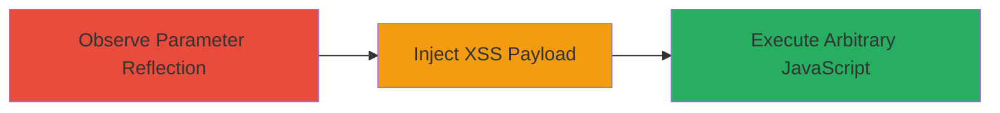

# Reflected XSS via 'pt' Parameter on Topcoder ReviewBoard

Multi-stage attack chain demonstrating exploitation of a reflected Cross-Site Scripting (XSS) vulnerability in the Topcoder website's ReviewBoard module. The attack begins with observing unsanitized reflection of the 'pt' parameter and progresses to injecting JavaScript payloads, enabling arbitrary code execution in users' browsers for impacts like cookie theft and phishing.

## Chain Metrics Dashboard

| Metric | Value |
|--------|-------|
| Chain Status | Unverified |
| Total Steps | 2 |
| Execution Time | ~5 minutes |
| Skill Level | Beginner |
| Complexity | Low |
| Impact Level | High |

## Attack Flow Visualization



## Prerequisites & Requirements

### Required Tools

- Web browser (e.g., Chrome or Firefox with developer tools)
- Optional: [[tools/Burp-Suite]] for advanced payload testing

### Target Environment

- Web platform
- Access to https://www.topcoder.com
- No authentication required for public pages

### Initial Access Requirements

- Public internet access
- No credentials needed
- Victim must visit the crafted malicious URL

## Detailed Attack Procedures

### Step 1: Observe Parameter Reflection
procedure: [[procedures/Observe-pt-Parameter-Reflection]]

**Objective**: Verify that the 'pt' parameter is reflected unsanitized in the page output, confirming the vulnerability exists.

**Instructions**: Navigate to the target URL using a web browser or [[commands/curl-check-reflection]] to inspect the response. Look for the 'pt' value directly embedded in the HTML without escaping.

```bash
curl "https://www.topcoder.com/tc?module=ReviewBoard&pt=1" | grep pt=1
```

**Expected Output**: The response HTML contains the raw 'pt=1' value reflected, e.g., in a div or script context.

**Success Indicators**:
- 'pt' value appears unescaped in page source
- No sanitization errors or blocks observed

### Step 2: Inject XSS Payload
procedure: [[procedures/Inject-XSS-Payload-into-pt-Parameter]]

**Objective**: Inject and execute a JavaScript payload via the 'pt' parameter to demonstrate XSS, such as displaying an alert or stealing cookies.

**Instructions**: Modify the URL with a malicious payload using [[commands/curl-inject-xss]]. Test in a browser to confirm execution. For HTML injection post-WAF, use payloads like '"><h1>TEST</h1>.

```bash
curl "https://www.topcoder.com/tc?module=ReviewBoard&pt=<script>confirm(1)</script>"
```

In a browser, visit the URL and check if the script executes (e.g., alert box appears).

**Expected Output**: JavaScript executes, showing confirm(1) dialog or injected HTML renders.

**Success Indicators**:
- Alert or confirm dialog pops up
- Injected HTML elements appear on the page
- Potential for further payloads like document.cookie theft

## Attack Chain Summary

### Key Achievements

1. Confirmed unsanitized reflection of user input in 'pt' parameter
2. Executed arbitrary JavaScript in victim browsers via reflected XSS
3. Demonstrated post-WAF HTML injection as a secondary vector

## Technique & Tactic Coverage

### MITRE ATT&CK Techniques

- [[JavaScript]]

### MITRE ATT&CK Tactics

- [[Execution]]
- [[Collection]]

---
*Last updated: 2024-10-01T00:00:00Z*
