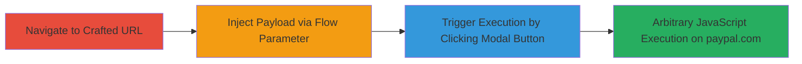

# Reflected XSS via Base64-Encoded Flow Parameter on PayPalMe Landing Page

Multi-stage attack chain demonstrating exploitation of a reflected XSS vulnerability on the PayPalMe landing page, where a base64-encoded 'flow' parameter is decoded and used in href attributes of modal buttons, allowing injection of javascript: schemes to execute arbitrary JavaScript upon user interaction.

## Chain Metrics Dashboard

| Metric | Value |
|--------|-------|
| Chain Status | Unverified |
| Total Steps | 4 |
| Execution Time | ~2 minutes |
| Skill Level | Intermediate |
| Complexity | Medium |
| Impact Level | High |

## Attack Flow Visualization

## Prerequisites & Requirements

### Required Tools

- [[tools/Chrome]]
- [[tools/Firefox]]
- [[tools/Safari]]

### Target Environment

- Web platform
- PayPalMe service on www.paypal.com
- No specific ports required (HTTPS/443 implied)
- Authenticated user session on paypal.com for impact demonstration

### Initial Access Requirements

- No credentials needed for landing page access
- Direct network access to www.paypal.com
- User interaction required (clicking modal button)

## Detailed Attack Procedures

### Step 1: Craft and Navigate to XSS Payload URL on Chrome or Firefox
procedure: [[procedures/Craft-and-Navigate-to-XSS-Payload-URL-on-Chrome-or-Firefox]]

**Objective**: Deliver the base64-encoded payload to the vulnerable 'flow' parameter to set up javascript: injection in modal hrefs.

**Instructions**: Open Chrome or Firefox and navigate to the crafted URL containing the encoded payload that bypasses restrictions using 'javascript:PAYPAL.com=' prefix and encoded SVG onload for execution.

The URL is: `https://www.paypal.com/paypalme/my/landing?flow=cmV0dXJuVXJsPWphdmFzY3JpcFQ6UEFZUEFMLmNvbSUzZDEsbG9jYXRpb24lM2QnamF2YXNjcmlwdDpceDNjc3ZnXHgyMG9ubG9hZD1hbGVydFx4Mjhkb2N1bWVudC5kb21haW5ceDI5XHgzZScmY2FuY2VsVXJsPWphdmFzY3JpcFQ6UEFZUEFMLmNvbSUzZDEsbG9jYXRpb24lM2QnamF2YXNjcmlwdDpceDNjc3ZnXHgyMG9ubG9hZD1hbGVydFx4Mjhkb2N1bWVudC5kb21haW5ceDI5XHgzZSc=`

**Expected Output**: Modal window appears on the PayPalMe landing page with injected hrefs.

**Success Indicators**:
- Page loads without errors
- Modal with 'X' or 'Done' button visible

### Step 2: Trigger XSS by Clicking Modal Button on Chrome or Firefox
procedure: [[procedures/Trigger-XSS-by-Clicking-Modal-Button-on-Chrome-or-Firefox]]

**Objective**: Execute the injected javascript: payload by interacting with the modal button, triggering the alert to confirm domain access.

**Instructions**: In the open modal, click the 'X' button to follow the href and execute the payload, which decodes to an SVG onload event running `alert(document.domain)`.

**Expected Output**: Alert box pops up displaying 'paypal.com' or similar, confirming JavaScript execution in the site's context.

**Success Indicators**:
- Alert dialog appears
- No browser errors; payload executes successfully

### Step 3: Craft and Navigate to XSS Payload URL on Safari
procedure: [[procedures/Craft-and-Navigate-to-XSS-Payload-URL-on-Safari]]

**Objective**: Use a Safari-specific payload variation to inject the javascript: URL, adapting for browser differences in encoding and scheme handling.

**Instructions**: Open Safari and navigate to the adapted URL: `https://www.paypal.com/paypalme/my/landing?flow=cmV0dXJuVXJsPWphdmFzY3JpcFQ6UEFZUEFMLmNvbSUzZDEsbG9jYXRpb24lM2QnamF2YXNjcmlwdDphbGVydFx4Mjhkb2N1bWVudC5kb21haW5ceDI5JyZjYW5jZWxVcmw9amF2YXNjcmlwVDpQQVlQQUwuY29tJTNkMSxsb2NhdGlvbiUzZCdqYXZhc2NyaXB0OmFsZXJ0XHgyOGRvY3VtZW50LmRvbWFpblx4Mjkn`

**Expected Output**: Modal window loads with the injected payload ready for triggering.

**Success Indicators**:
- Landing page renders correctly
- Modal buttons present without sanitization blocking the payload

### Step 4: Trigger XSS by Clicking Modal Button on Safari
procedure: [[procedures/Trigger-XSS-by-Clicking-Modal-Button-on-Safari]]

**Objective**: Activate the payload in Safari to demonstrate cross-browser exploitation, executing the alert on the paypal.com domain.

**Instructions**: Click the 'X' button in the modal to trigger the href navigation and JavaScript execution.

**Expected Output**: Alert box shows the document domain, verifying successful XSS in Safari.

**Success Indicators**:
- JavaScript alert executes
- Potential for further actions as authenticated user if session present

## Attack Chain Summary

### Key Achievements

1. Bypassed input validation on base64 'flow' parameter to inject javascript: schemes.
2. Demonstrated execution across multiple browsers (Chrome, Firefox, Safari).
3. Achieved arbitrary JavaScript in paypal.com context, enabling potential account actions with user interaction.

## Technique & Tactic Coverage

### MITRE ATT&CK Techniques

- [[JavaScript]]
- [[Exploit Public-Facing Application]]

### MITRE ATT&CK Tactics

- [[Initial Access]]
- [[Execution]]

---

*Last updated: 2023-10-01T00:00:00Z*
