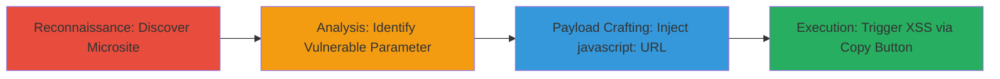

---
tags:
  - xss
  - reflected-xss
  - javascript
  - web
  - social-engineering
type: attack_chain
tools:
  - '[[tools/Google-Chrome]]'
  - '[[tools/Mozilla-Firefox]]'
tactics:
  - '[[Execution]]'
  - '[[Collection]]'
verified: false
platforms:
  - Web
submitted: true
complexity: medium
created_at: '2023-10-01T00:00:00Z'
procedures:
  - '[[procedures/Discover-Microsite-via-Social-Media-Recon]]'
  - '[[procedures/Analyze-Page-and-Identify-Vulnerable-Parameter]]'
  - '[[procedures/Craft-and-Encode-Malicious-XSS-Payload]]'
  - '[[procedures/Trigger-XSS-Execution-via-Copy-Button]]'
step_count: 4
techniques:
  - '[[JavaScript]]'
  - '[[Drive-by Compromise]]'
updated_at: '2025-12-13T23:52:25.448Z'
description: >-
  Multi-stage attack exploiting a reflected XSS vulnerability in the
  Base64-encoded 'q' parameter on Grab's Valentine's microsite, allowing
  arbitrary JavaScript execution in the victim's browser session.
skill_level: intermediate
impact_level: high
id: 9fbdf645-68eb-4d66-8a37-affab61a119f
validated: true
mitre_tactics:
  - '[[Execution]]'
  - '[[Collection]]'
mitre_techniques:
  - '[[JavaScript]]'
  - '[[Drive-by Compromise]]'
---
# Reflected XSS via Base64-Encoded Promo Code on Grab Valentine's Microsite

Multi-stage attack chain demonstrating a reflected XSS vulnerability on the Valentine's microsite at growth.grab.com/valentine/active/my.html. The attack leverages the 'q' parameter, which contains Base64-encoded JSON data including a 'promo_code' field. By injecting a javascript: URL into this field, an attacker can execute arbitrary JavaScript when the victim interacts with the page, such as clicking the 'copy' button. This enables theft of session cookies, local storage, or other client-side data in the growth.grab.com context.

## Chain Metrics Dashboard

| Metric | Value |
|--------|-------|
| Chain Status | Unverified |
| Total Steps | 4 |
| Execution Time | ~10 minutes |
| Skill Level | Intermediate |
| Complexity | Medium |
| Impact Level | High |

## Attack Flow Visualization



## Prerequisites & Requirements

### Required Tools

- [[tools/Google-Chrome]]
- [[tools/Mozilla-Firefox]]

### Target Environment

- Web platform
- Access to Twitter for reconnaissance
- No specific ports or services required beyond standard HTTPS (443)

### Initial Access Requirements

- No credentials needed
- Public internet access
- Ability to craft and share URLs (e.g., via social engineering)

## Detailed Attack Procedures

### Step 1: Discover Microsite via Social Media Recon
procedure: [[procedures/Discover-Microsite-via-Social-Media-Recon]]

**Objective**: Identify the target microsite through public mentions to find shareable content that can be manipulated.

**Instructions**: Perform a manual search on Twitter for recent mentions of 'grab.com' to locate shareable Valentine's cards for drivers on growth.grab.com.

**Expected Output**: Identification of the URL https://growth.grab.com/valentine/active/my.html.

**Success Indicators**:
- Relevant tweets found mentioning the microsite
- Confirmation of shareable card features

### Step 2: Analyze Page and Identify Vulnerable Parameter
procedure: [[procedures/Analyze-Page-and-Identify-Vulnerable-Parameter]]

**Objective**: Examine the page structure to locate the injectable parameter.

**Instructions**: Visit the page and inspect the 'q' parameter in the URL https://growth.grab.com/valentine/active/my.html?q=, which contains Base64-encoded JSON with fields like 'name', 'start_date', 'promo_code'. Note that 'promo_code' is intended for referral URLs.

**Expected Output**: Understanding of the JSON structure and identification of 'promo_code' as the injection point.

**Success Indicators**:
- Decoded Base64 reveals JSON with 'promo_code' field
- Field accepts arbitrary strings without validation

### Step 3: Craft and Encode Malicious XSS Payload
procedure: [[procedures/Craft-and-Encode-Malicious-XSS-Payload]]

**Objective**: Create a payload that injects JavaScript into the 'promo_code' field and encode it for delivery.

**Instructions**: Modify the JSON by injecting a javascript: URL into 'promo_code', e.g., {"name": "Test HackerOne", "start_date": "01.01.2018", "leanplum_id": "test", "rides": "200", "places": "20", "distance": 500, "cancel_times": "0", "days": "100", "promo_code": "javascript://r.grab.com/test%0aalert(document.domain)", "prf_reward": "10"}. Then Base64-encode it using a tool like base64 command:

```bash
echo -n '{"name": "Test HackerOne", "start_date": "01.01.2018", "leanplum_id": "test", "rides": "200", "places": "20", "distance": 500, "cancel_times": "0", "days": "100", "promo_code": "javascript://r.grab.com/test%0aalert(document.domain)", "prf_reward": "10"}' | base64
```

Resulting in: eyJuYW1lIjogIlRlc3QgSGFja2VyT25lIiwgInN0YXJ0X2RhdGUiOiAiMDEuMDEuMjAxOCIsICJsZWFucGx1bV9pZCI6ICJ0ZXN0IiwgInJpZGVzIjogIjIwMCIsICJwbGFjZXMiOiAiMjAiLCAiZGlzdGFuY2UiOiA1MDAsICJjYW5jZWxfdGltZXMiOiAiMCIsICJkYXlzIjogIjEwMCIsICJwcm9tb19jb2RlIjogImphdmFzY3JpcHQ6Ly9yLmdyYWIuY29tL3Rlc3QlMGFhbGVydChkb2N1bWVudC5kb21haW4pIiwgInByZl9yZXdhcmQiOiAiMTAifQ==

Construct the full URL: https://growth.grab.com/valentine/active/my.html?q=<encoded_string>.

**Expected Output**: Malicious URL ready for delivery to victim.

**Success Indicators**:
- Payload mimics a valid referral URL
- Base64 encoding succeeds without errors

### Step 4: Trigger XSS Execution via Copy Button
procedure: [[procedures/Trigger-XSS-Execution-via-Copy-Button]]

**Objective**: Execute the injected JavaScript in the victim's browser context.

**Instructions**: Have the victim visit the malicious URL. Once on the page, scroll down and click the bottom 'copy' button, which processes the 'promo_code' and triggers the javascript: URL, executing the payload.

**Expected Output**: Alert box displaying 'growth.grab.com' or arbitrary JS execution.

**Success Indicators**:
- JavaScript executes in growth.grab.com context
- Potential for cookie theft or session hijacking confirmed

## Attack Chain Summary

### Key Achievements

1. Discovered vulnerable microsite via public social media reconnaissance
2. Injected and encoded malicious javascript: payload in Base64 JSON
3. Achieved arbitrary JS execution upon user interaction, enabling client-side attacks

## Technique & Tactic Coverage

### MITRE ATT&CK Techniques

- [[JavaScript]]
- [[Drive-by Compromise]]

### MITRE ATT&CK Tactics

- [[Execution]]
- [[Collection]]

---

*Last updated: 2023-10-01T00:00:00Z*
