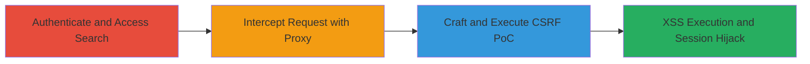

---
id: ac-gratipay-xss-csrf-001
name: Reflected XSS via CSRF in Gratipay Search Functionality
type: attack_chain
description: A multi-stage attack exploiting reflected XSS in Gratipay's search feature combined with CSRF to inject JavaScript payloads, enabling session hijacking and data theft.
verified: false
submitted: false
step_count: 3
created_at: 2023-10-01T00:00:00Z
updated_at: 2023-10-01T00:00:00Z
procedures: [[procedures/Authenticate-and-Access-Gratipay-Search]], [[procedures/Intercept-and-Modify-Search-Request-with-Burp-Suite]], [[procedures/Craft-and-Execute-CSRF-POC-for-XSS-Injection]]
techniques: [[JavaScript]], [[Drive-by Compromise]]
tactics: [[Execution]], [[Collection]]
tags: xss, csrf, web, javascript, session-hijacking
platforms: Web
tools: [[tools/Burp-Suite]]
---

# Reflected XSS via CSRF in Gratipay Search Functionality

Multi-stage attack chain demonstrating a complete attack workflow exploiting vulnerabilities in the Gratipay search functionality.

## Chain Metrics Dashboard

| Metric | Value |
|--------|-------|
| Chain Status | Unverified |
| Total Steps | 3 |
| Execution Time | ~5 minutes |
| Skill Level | Intermediate |
| Complexity | Medium |
| Impact Level | High |

## Attack Flow Visualization

## Prerequisites & Requirements

### Required Tools

- [[tools/Burp-Suite]]

### Target Environment

- Web platform
- Access to Gratipay at https://gratipay.com/
- Valid user credentials for authentication

### Initial Access Requirements

- User account on Gratipay
- Browser with proxy support (e.g., configured for Burp Suite)
- Local file access to host CSRF PoC

## Detailed Attack Procedures

### Step 1: Authenticate and Access Search
procedure: [[procedures/Authenticate-and-Access-Gratipay-Search]]

**Objective**: Gain authenticated access to the Gratipay application and navigate to the vulnerable search functionality to prepare for request interception.

**Instructions**: Log in to the Gratipay website using valid credentials and proceed to the search page. This establishes a session that can be targeted by the CSRF exploit.

**Expected Output**: Successful login and access to https://gratipay.com/search, with the search interface loaded.

**Success Indicators**:
- Authentication successful, session cookies set
- Search page accessible without errors

### Step 2: Intercept and Modify Search Request
procedure: [[procedures/Intercept-and-Modify-Search-Request-with-Burp-Suite]]

**Objective**: Capture the legitimate search request using a proxy tool to understand the request structure and prepare for payload modification.

**Instructions**: Configure your browser to route traffic through Burp Suite, perform a benign search query, and intercept the HTTP POST or GET request containing the search parameter.

**Expected Output**: Intercepted request visible in Burp Suite, showing the search parameter (e.g., ?search=query).

**Success Indicators**:
- Request captured successfully
- Search parameter identified for payload injection

### Step 3: Craft and Execute CSRF PoC
procedure: [[procedures/Craft-and-Execute-CSRF-POC-for-XSS-Injection]]

**Objective**: Create a malicious CSRF HTML page that submits a search query with an XSS payload, then execute it to trigger the reflected XSS and observe the impact.

**Instructions**: Modify the intercepted request in the CSRF PoC to include the payload `` in the search parameter. Save as an HTML file and open it in a browser while authenticated to Gratipay.

**Expected Output**: JavaScript alert box displaying the document domain, confirming XSS execution.

**Success Indicators**:
- Alert triggered on Gratipay domain
- Potential for cookie theft or keystroke logging in a real exploit

## Attack Chain Summary

### Key Achievements

1. Successful authentication and access to vulnerable search endpoint
2. Interception and analysis of search requests enabling payload crafting
3. CSRF-induced XSS execution leading to arbitrary JavaScript in victim context

## Technique & Tactic Coverage

### MITRE ATT&CK Techniques

- [[JavaScript]]
- [[Drive-by Compromise]]

### MITRE ATT&CK Tactics

- [[Execution]]
- [[Collection]]

---
*Last updated: 2023-10-01T00:00:00Z*
