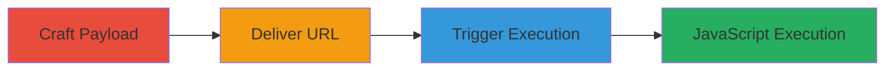

---
tags:
  - xss
  - reflected-xss
  - waf-bypass
  - javascript-injection
  - attribute-injection
type: attack_chain
tools:
  - '[[tools/Firefox-Quantum]]'
tactics:
  - '[[Execution]]'
verified: false
platforms:
  - Web
submitted: true
complexity: medium
created_at: '2023-10-01T00:00:00Z'
procedures:
  - '[[procedures/Craft-Double-Encoded-XSS-Payload-for-WAF-Bypass]]'
  - '[[procedures/Deliver-Reflected-XSS-Payload-via-404-URL]]'
  - '[[procedures/Trigger-XSS-Execution-with-Accesskey-Onclick]]'
step_count: 3
techniques:
  - '[[JavaScript]]'
updated_at: '2025-12-13T23:55:06.153Z'
description: >-
  A multi-step attack exploiting a reflected XSS vulnerability on Starbucks 404
  error pages by injecting malicious attributes into the canonical link tag,
  bypassing a WAF with double URL encoding, and triggering JavaScript execution
  via user interaction.
skill_level: intermediate
impact_level: high
id: f6b1739f-2dcf-4bc0-95b1-90ff39cf015a
validated: true
mitre_tactics:
  - '[[Execution]]'
mitre_techniques:
  - '[[JavaScript]]'
---
# Reflected XSS via Canonical Link Attribute Injection on Starbucks 404 Pages

Multi-stage attack chain demonstrating a complete reflected XSS workflow on Starbucks websites, leveraging insufficient sanitization on 404 pages to inject malicious attributes into the canonical link tag. The attack bypasses a WAF using double URL encoding and requires victim interaction to execute arbitrary JavaScript, potentially leading to session hijacking or data theft.

## Chain Metrics Dashboard

| Metric | Value |
|--------|-------|
| Chain Status | Unverified |
| Total Steps | 3 |
| Execution Time | ~5 minutes |
| Skill Level | Intermediate |
| Complexity | Medium |
| Impact Level | High |

## Attack Flow Visualization

## Prerequisites & Requirements

### Required Tools

- [[tools/Firefox-Quantum]]

### Target Environment

- Web platform with 404 error pages (e.g., Starbucks domains like www.starbucks.co.uk)
- Presence of a WAF filtering double quotes
- No specific ports or services beyond HTTP/HTTPS access

### Initial Access Requirements

- No credentials required
- Public network access to target domains
- Victim must visit the malicious URL and perform key interaction

## Detailed Attack Procedures

### Step 1: Craft Payload
procedure: [[procedures/Craft-Double-Encoded-XSS-Payload-for-WAF-Bypass]]

**Objective**: Create a double URL-encoded XSS payload that injects malicious attributes into the canonical link tag while evading WAF detection of double quotes.

**Instructions**: Manually construct the payload starting with a junk prefix, followed by the injection point using double quotes, accesskey for triggering, and onclick for JavaScript execution. Double-encode to bypass WAF redirection.

**Expected Output**: A fully encoded URL string ready for delivery.

**Success Indicators**:
- Payload encodes without errors
- No immediate WAF block during testing

### Step 2: Deliver Payload
procedure: [[procedures/Deliver-Reflected-XSS-Payload-via-404-URL]]

**Objective**: Load the 404 page on a target domain using the crafted URL to reflect the payload into the canonical link tag.

**Instructions**: Use a web browser to access the malicious URL on an affected domain, such as https://www.starbucks.co.uk followed by the encoded path. The 404 handler will unsafely insert the path into the href attribute.

**Expected Output**: 404 page loads with injected attributes visible in the page source (e.g., <link rel="canonical" href="https://www.starbucks.co.uk/injected-payload">

**Success Indicators**:
- Page loads without WAF block
- Source code shows attribute injection

### Step 3: Trigger Execution
procedure: [[procedures/Trigger-XSS-Execution-with-Accesskey-Onclick]]

**Objective**: Activate the injected JavaScript by simulating user interaction via the accesskey, executing arbitrary code in the victim's browser context.

**Instructions**: With the page loaded, press the platform-specific key combination to trigger the accesskey='x', which fires the onclick event and runs the confirm script.

**Expected Output**: Alert box or confirm dialog appears, confirming JavaScript execution.

**Success Indicators**:
- Dialog box pops up
- No errors in browser console

## Attack Chain Summary

### Key Achievements

1. Successful WAF bypass using double URL encoding
2. Attribute injection into canonical link without sanitization
3. Arbitrary JavaScript execution via user-triggered accesskey

## Technique & Tactic Coverage

### MITRE ATT&CK Techniques

- [[JavaScript]]

### MITRE ATT&CK Tactics

- [[Execution]]

---

*Last updated: 2023-10-01T00:00:00Z*
