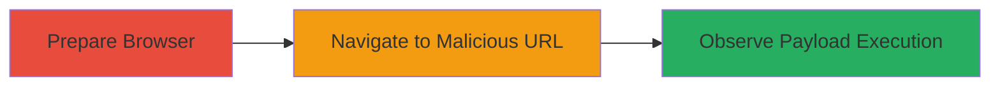

# Reflected XSS via Ctg Parameter Leading to Arbitrary JavaScript Execution

Multi-stage attack chain demonstrating a complete attack workflow exploiting a reflected Cross-Site Scripting (XSS) vulnerability on videostore.mtnonline.com.

## Chain Metrics Dashboard

| Metric | Value |
|--------|-------|
| Chain Status | Unverified |
| Total Steps | 3 |
| Execution Time | ~1 minute |
| Skill Level | Beginner |
| Complexity | Low |
| Impact Level | High |

## Attack Flow Visualization

## Prerequisites & Requirements

### Required Tools

- Standard web browser (e.g., Chrome, Firefox)

### Target Environment

- Web platform
- Accessible URL: https://videostore.mtnonline.com/GL/Default.aspx
- No specific services/ports required beyond HTTP/HTTPS

### Initial Access Requirements

- No credentials needed
- Direct network access to the target URL
- Victim's browser context (e.g., via phishing link)

## Detailed Attack Procedures

### Step 1: Prepare Web Browser
procedure: [[procedures/Exploit-Reflected-XSS-in-Ctg-Parameter]]

**Objective**: Open a web browser to test the vulnerable endpoint without interference from extensions or security features.

**Instructions**: Launch a standard web browser in incognito or private mode to ensure a clean environment. Disable any browser extensions that might block JavaScript or alter requests.

**Expected Output**: Browser window ready for navigation.

**Success Indicators**:
- Browser opens successfully
- No blocking extensions active

### Step 2: Navigate to Crafted Malicious URL
procedure: [[procedures/Exploit-Reflected-XSS-in-Ctg-Parameter]]

**Objective**: Access the vulnerable endpoint with a payload in the 'Ctg' parameter to trigger the reflected XSS.

**Instructions**: Enter or bookmark the following URL in the browser address bar:

https://videostore.mtnonline.com/GL/Default.aspx?PId=126&CId=5&OprId=11&Ctg=OF25MTNNGVS_LapsInTime%22%27testxxx%3E%3Ciframe%20src=%22data:text/html,%3C%73%63%72%69%70%74%3E%61%6C%65%72%74%28%31%29%3C%2F%73%63%72%69%70%74%3E%22%3E%3C/iframe%3E

This URL encodes a JavaScript payload in the 'Ctg' parameter: OF25MTNNGVS_LapsInTime"'testxxx><iframe src="data:text/html,"></iframe>. The payload breaks out of the expected HTML context and injects an iframe that executes alert(1).

**Expected Output**: The page loads, and the payload is reflected in the HTML response.

**Success Indicators**:
- Page renders without errors
- Payload visible in page source (inspect element)

### Step 3: Observe Payload Execution
procedure: [[procedures/Exploit-Reflected-XSS-in-Ctg-Parameter]]

**Objective**: Confirm the JavaScript execution by observing the alert dialog, validating the XSS vulnerability.

**Instructions**: After loading the URL, inspect the page source to verify the unsanitized reflection of the 'Ctg' parameter. The browser should automatically execute the injected script.

**Expected Output**: An alert popup displays '1' in the browser.

**Success Indicators**:
- Alert dialog appears
- JavaScript console shows no blocking errors
- Potential for further payloads like cookie theft confirmed

## Attack Chain Summary

### Key Achievements

1. Successful reflection of user-controlled input without sanitization
2. Arbitrary JavaScript execution in the browser context
3. Demonstration of high-severity impact (CVSS 8.8) including session hijacking potential

## Technique & Tactic Coverage

### MITRE ATT&CK Techniques

- [[JavaScript]]

### MITRE ATT&CK Tactics

- [[Execution]]

---

*Last updated: 2023-10-01T12:00:00Z*
