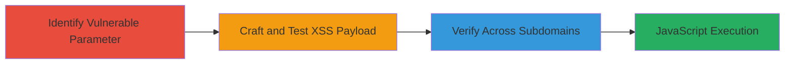

# Reflected XSS via Currency Parameter on WordPress.com Website Endpoint

Multi-stage attack chain demonstrating a reflected Cross-Site Scripting (XSS) vulnerability in the 'currency' query parameter of the /website/ endpoint on www.wordpress.com. The attack involves identifying the vulnerable parameter, crafting a payload to break out of HTML attributes and execute JavaScript, and verifying the impact across language-specific subdomains like en.wordpress.com. This could lead to malicious script execution in victims' browsers, enabling session theft or phishing.

## Chain Metrics Dashboard

| Metric | Value |
|--------|-------|
| Chain Status | Unverified |
| Total Steps | 3 |
| Execution Time | ~5 minutes |
| Skill Level | Intermediate |
| Complexity | Medium |
| Impact Level | High |

## Attack Flow Visualization

## Prerequisites & Requirements

### Required Tools

- Web browser (e.g., Chrome Developer Tools for payload testing)
- URL encoding tool (built-in browser or online encoder)

### Target Environment

- Web platform
- Publicly accessible WordPress.com website endpoint
- No specific ports required (HTTPS on 443)
- Network access: Direct internet connectivity to wordpress.com

### Initial Access Requirements

- No credentials needed (public-facing endpoint)
- Attacker positioned as a remote user
- No prior access required

## Detailed Attack Procedures

### Step 1: Identify Vulnerable Endpoint and Parameter
procedure: [[procedures/Identify-XSS-Vulnerable-Parameters-in-Web-Endpoints]]

**Objective**: Locate the /website/ endpoint and test the 'currency' query parameter for XSS injection points by observing how input is reflected in the HTML response.

**Instructions**: Access the base URL https://wordpress.com/website/ in a web browser. Append the 'currency' parameter with benign test values (e.g., ?currency=USD) and inspect the page source using browser developer tools (F12) to see where the value is reflected, such as in HTML attributes or tags.

**Expected Output**: The parameter value appears unsanitized in the HTML, e.g., within a <title> or attribute context, indicating potential for breakout.

**Success Indicators**:
- Parameter reflection observed without proper escaping
- No immediate errors or sanitization visible in response

### Step 2: Craft and Test XSS Payload
procedure: [[procedures/Exploit-Reflected-XSS-with-HTML-Attribute-Breakout]]

**Objective**: Inject a crafted payload into the 'currency' parameter to break out of the HTML context and execute arbitrary JavaScript, such as prompting the document domain.

**Instructions**: URL-encode a payload that closes the current HTML tag/attribute and injects a script or event handler. For example, use the payload '%3C/title%3E%3C/script/%22-alert%280%29-%22--%3E%22%3E%3Csvg/onload=prompt%28document.domain%29%3E', which decodes to '<title><script/"-alert(0)-"--><svg/onload=prompt(document.domain)>'. Append it to the URL: https://wordpress.com/website/?currency=%3C/title%3E%3C/script/%22-alert%280%29-%22--%3E%22%3E%3Csvg/onload=prompt%28document.domain%29%3E. Load the page and observe if JavaScript executes.

**Expected Output**: A JavaScript alert or prompt appears, confirming execution (e.g., alerting 'wordpress.com').

**Success Indicators**:
- Payload decodes and breaks out of attributes
- JavaScript runs in the browser context

### Step 3: Verify Impact Across Languages
procedure: [[procedures/Verify-XSS-Impact-Across-Language-Subdomains]]

**Objective**: Confirm the vulnerability affects multiple language subdomains, demonstrating broader impact on users accessing localized versions.

**Instructions**: Repeat the payload injection on subdomains like https://en.wordpress.com/website/?currency=[encoded-payload]. Test additional languages (e.g., fr.wordpress.com) to ensure universal exploitation without localization-specific fixes. Inspect responses for consistent reflection and execution.

**Expected Output**: JavaScript executes identically across tested subdomains, prompting the respective domain.

**Success Indicators**:
- Consistent payload success on multiple subdomains
- No blocking or sanitization differences observed

## Attack Chain Summary

### Key Achievements

1. Identified and confirmed reflected XSS in a public WordPress.com endpoint
2. Executed arbitrary JavaScript via attribute breakout, proving potential for session theft
3. Demonstrated vulnerability scope across international subdomains

## Technique & Tactic Coverage

### MITRE ATT&CK Techniques

- [[JavaScript]]

### MITRE ATT&CK Tactics

- [[Execution]]
- [[Collection]]

---
*Last updated: 2023-10-01T00:00:00Z*
