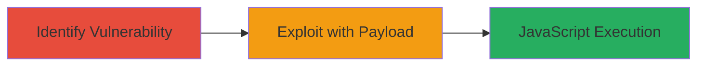

# Reflected XSS via Double Encoding in Search Query

Multi-stage attack chain demonstrating exploitation of a reflected XSS vulnerability in the search query on support.rockstargames.com using double-encoding to bypass filters, resulting in arbitrary JavaScript execution for potential session hijacking or data theft.

## Chain Metrics Dashboard

| Metric | Value |
|--------|-------|
| Chain Status | Unverified |
| Total Steps | 2 |
| Execution Time | ~5 minutes |
| Skill Level | Intermediate |
| Complexity | Medium |
| Impact Level | Medium |

## Attack Flow Visualization



## Prerequisites & Requirements

### Required Tools

- Web browser with developer tools
- [[tools/curl]]

### Target Environment

- Web platform
- Publicly accessible search endpoint on support.rockstargames.com
- No authentication required for search

### Initial Access Requirements

- Internet access to the target site
- No prior credentials needed
- Ability to craft and submit HTTP requests

## Detailed Attack Procedures

### Step 1: Identify Reflected XSS in Search Functionality
procedure: [[procedures/Identify-Reflected-XSS-in-Search-Functionality]]

**Objective**: Test the search query parameter for reflected XSS by submitting basic payloads to detect unfiltered output.

**Instructions**: Use [[commands/test-basic-xss-payload]] to probe the search endpoint with a simple script tag:

```bash
curl -X GET "https://support.rockstargames.com/search?q=%3Cscript%3Ealert(1)%3C/script%3E" -v
```

Observe if the payload is reflected in the response without sanitization. If blocked, proceed to encoding tests.

**Expected Output**: HTTP response containing the reflected payload, potentially triggering an alert in a browser context.

**Success Indicators**:
- Payload appears in page source
- Basic alert executes in browser

### Step 2: Exploit Reflected XSS with Double Encoding
procedure: [[procedures/Exploit-Reflected-XSS-with-Double-Encoding]]

**Objective**: Bypass input filters by double-encoding the XSS payload and execute arbitrary JavaScript to simulate session theft.

**Instructions**: Craft a double-encoded payload (e.g., %253Cscript%253Ealert(document.cookie)%253C/script%253E) and submit using [[commands/test-double-encoded-xss]]:

```bash
curl -X GET "https://support.rockstargames.com/search?q=%253Cscript%253Ealert(document.cookie)%253C/script%253E" -v
```

In a browser, visit the URL to trigger execution. Verify by checking for cookie alert or network requests.

**Expected Output**: Reflected double-decoded payload executes, displaying cookies or performing client-side actions.

**Success Indicators**:
- JavaScript alert shows session data
- Arbitrary code runs without filter interference

## Attack Chain Summary

### Key Achievements

1. Bypassed input validation using double URL encoding
2. Achieved reflected XSS execution in search results
3. Demonstrated potential for session hijacking and client-side attacks

## Technique & Tactic Coverage

### MITRE ATT&CK Techniques

- [[Exploit Public-Facing Application]]
- [[JavaScript]]

### MITRE ATT&CK Tactics

- [[Execution]]
- [[Collection]]

---
*Last updated: 2023-10-01T00:00:00Z*
