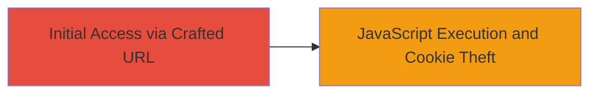

# Reflected XSS via Error Parameter in Acronis Admin Panel

Multi-stage attack chain demonstrating a complete attack workflow.

## Chain Metrics Dashboard

| Metric | Value |
|--------|-------|
| Chain Status | Unverified |
| Total Steps | 1 |
| Execution Time | ~1 minute |
| Skill Level | Beginner |
| Complexity | Low |
| Impact Level | High |

## Attack Flow Visualization



## Prerequisites & Requirements

### Required Tools

- Web browser (e.g., Chrome, Firefox)

### Target Environment

- Web platform
- Access to https://admin.acronis.com/admin/su/ endpoint
- No specific services/ports beyond standard HTTPS (443)

### Initial Access Requirements

- Ability to send the crafted URL to a victim (e.g., via phishing email or social engineering)
- Victim must be an authorized user of the admin panel
- No prior credentials needed for the attacker, but victim authentication enables higher impact

## Detailed Attack Procedures

### Step 1: Trigger XSS Payload
procedure: [[procedures/Exploit-Reflected-XSS-in-Error-Parameter]]

**Objective**: Deliver and execute arbitrary JavaScript in the victim's browser by exploiting the unescaped Error parameter, leading to cookie theft or phishing.

**Instructions**: Craft a malicious URL with a URL-encoded JavaScript payload in the Error parameter. For testing, open the URL directly in a browser; for real attacks, embed in a phishing link.

Example payload URL:

```url
https://admin.acronis.com/admin/su/?Error=%3cscript%3ealert(document.domain)%3c%2fscript%3e
```

To verify reflection without execution, use a non-executing payload like:

```url
https://admin.acronis.com/admin/su/?Error=%3cimg%20src=x%20onerror=alert(document.domain)%3e
```

In a real attack, replace the alert with code to exfiltrate cookies, e.g., sending to an attacker-controlled server.

**Expected Output**: The payload executes on page load, displaying an alert (for test) or performing the intended action (e.g., cookie theft via XMLHttpRequest).

**Success Indicators**:
- JavaScript alert pops up showing the domain
- In browser dev tools, confirm the script tag is injected unescaped in the HTML response
- Network tab shows any exfiltration requests if payload includes data sending

## Attack Chain Summary

### Key Achievements

1. Successful injection and execution of arbitrary JavaScript in the admin panel context
2. Potential theft of authentication cookies from authorized users
3. Enablement of phishing or malware distribution targeting admin users

## Technique & Tactic Coverage

### MITRE ATT&CK Techniques

- [[JavaScript]]
- [[Steal Web Session Cookie]]

### MITRE ATT&CK Tactics

- [[Execution]]
- [[Credential Access]]

---
*Last updated: 2023-10-01T00:00:00Z*
