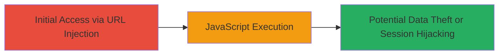

---
tags:
  - xss
  - reflected-xss
  - waf-bypass
  - javascript
  - web-vulnerability
type: attack_chain
tools: []
tactics:
  - '[[Initial Access]]'
  - '[[Execution]]'
verified: false
platforms:
  - Web
submitted: true
complexity: medium
created_at: '2023-10-01T00:00:00Z'
procedures:
  - '[[procedures/Inject-XSS-Payload-Using-onfocus-and-Autofocus]]'
step_count: 1
techniques:
  - '[[Exploit Public-Facing Application]]'
  - '[[JavaScript]]'
updated_at: '2025-12-14T03:16:08.353Z'
description: >-
  A single-stage attack exploiting a reflected XSS vulnerability in a U.S.
  Department of Defense web application by injecting a crafted JavaScript
  payload into a URL parameter, evading WAF filters to execute arbitrary code in
  the victim's browser.
skill_level: intermediate
impact_level: high
id: d89c27fd-3053-4287-82ad-31e7411f6ae6
validated: true
mitre_tactics:
  - '[[Initial Access]]'
  - '[[Execution]]'
mitre_techniques:
  - '[[Exploit Public-Facing Application]]'
  - '[[JavaScript]]'
---
# Reflected XSS via Event Handler Injection Bypassing WAF in DoD Web Application

Multi-stage attack chain demonstrating a complete attack workflow.

## Chain Metrics Dashboard

| Metric | Value |
|--------|-------|
| Chain Status | Unverified |
| Total Steps | 1 |
| Execution Time | ~1 minutes |
| Skill Level | Intermediate |
| Complexity | Medium |
| Impact Level | High |

## Attack Flow Visualization

## Prerequisites & Requirements

### Required Tools

- Web browser (e.g., Chrome, Firefox) for payload delivery
- Optional: [[tools/Burp-Suite]] for parameter manipulation

### Target Environment

- Web application hosted on U.S. Department of Defense infrastructure
- Accessible via public URL
- Web Application Firewall (WAF) in place that filters HTML tags but allows event handlers

### Initial Access Requirements

- Direct access to the target URL
- No authentication required for the vulnerable endpoint
- Victim interaction: The page must load in the victim's browser to trigger focus

## Detailed Attack Procedures

### Step 1: Inject XSS Payload into Vulnerable Parameter
procedure: [[procedures/Inject-XSS-Payload-Using-onfocus-and-Autofocus]]

**Objective**: Deliver a reflected XSS payload via the URL parameter to execute JavaScript in the victim's browser, bypassing WAF by avoiding HTML tags and using focus-based event handlers.

**Instructions**: Construct the malicious URL by appending the crafted payload to the vulnerable parameter. The payload breaks out of a quoted attribute context and injects an onfocus event handler with autofocus and tabindex to trigger execution on page load when focus is gained.

Use a web browser to access the URL directly, or simulate via developer tools. For testing, replace redacted parts with actual values (e.g., https://target.gov/search?query=).

Example payload construction:

1. Base URL: https://█████/██████=
2. Injected value: ████" o onfocus=confirm(1337) autofocus tabindex=1 xss
3. URL-encoded: %22%20o%3Cbr%3Eonfocus=confirm(1337)%20autofocus%20tabindex=1%20xss

Full URL: https://█████/██████=████%22%20o%3Cbr%3Eonfocus=confirm(1337)%20autofocus%20tabindex=1%20xss

**Expected Output**: Upon loading the page in the victim's browser, a confirm dialog with '1337' appears, confirming JavaScript execution.

**Success Indicators**:
- Confirm dialog or alert box appears without errors
- Browser console shows no blocking by WAF
- Inspect page source to verify payload reflection in the parameter

## Attack Chain Summary

### Key Achievements

1. Successful WAF bypass using non-tag-based payload
2. Arbitrary JavaScript execution in victim context
3. Demonstration of potential for session hijacking or data exfiltration

## Technique & Tactic Coverage

### MITRE ATT&CK Techniques

- [[Exploit Public-Facing Application]]
- [[JavaScript]]

### MITRE ATT&CK Tactics

- [[Initial Access]]
- [[Execution]]

---
*Last updated: 2023-10-01T00:00:00Z*
