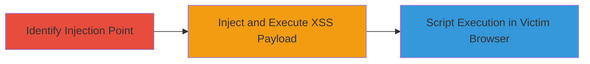

# Reflected XSS via HTML Injection in Nord Security Application (IE Only)

Multi-stage attack chain demonstrating a complete attack workflow.

## Chain Metrics Dashboard

| Metric | Value |
|--------|-------|
| Chain Status | Unverified |
| Total Steps | 1 |
| Execution Time | ~5 minutes |
| Skill Level | Beginner |
| Complexity | Low |
| Impact Level | Low |

## Attack Flow Visualization

## Prerequisites & Requirements

### Required Tools

- Internet Explorer browser (version vulnerable to the injection, pre-2021 support end)

### Target Environment

- Web application hosted by Nord Security
- Unspecified input field vulnerable to HTML injection
- Network access to the public-facing web app

### Initial Access Requirements

- No credentials required
- Victim must use Internet Explorer
- Ability to send malicious links via phishing or social engineering

## Detailed Attack Procedures

### Step 1: Exploit Reflected XSS
procedure: [[procedures/Exploit-Reflected-XSS-via-HTML-Injection]]

**Objective**: Identify the HTML injection point and deliver a reflected XSS payload to execute arbitrary JavaScript in the victim's Internet Explorer browser.

**Instructions**: Open Internet Explorer and navigate to the vulnerable Nord Security web application page with an input field (e.g., search or comment form). Enter a test payload to confirm injection, such as ``. Submit the input and observe if the payload reflects unsanitized in the response, triggering the alert in IE due to its lenient HTML parsing.

For exploitation, craft a URL with the payload, e.g., `https://app.nordsecurity.com/search?q=`, and send it to the victim via email or link. When the victim clicks in IE, the script executes.

**Expected Output**: JavaScript alert or console execution confirming payload delivery; potential access to victim cookies or DOM manipulation.

**Success Indicators**:
- Payload reflects without sanitization in page source
- Script executes only in Internet Explorer (fails in modern browsers like Chrome)
- Low-severity impact: No account compromise, but demonstrates script execution risk

## Attack Chain Summary

### Key Achievements

1. Successful HTML injection confirmation in target input field
2. Reflected XSS payload execution limited to IE users
3. Bounty awarded without broader security implications due to IE's deprecation

## Technique & Tactic Coverage

### MITRE ATT&CK Techniques

- [[JavaScript]]

### MITRE ATT&CK Tactics

- [[Execution]]

---
*Last updated: 2023-10-01T00:00:00Z*
