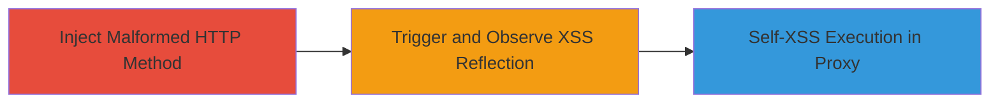

---
tags:
  - xss
  - http-injection
  - web
  - self-xss
type: attack_chain
tools:
  - '[[tools/Burp-Suite]]'
  - '[[tools/Browsershots-org]]'
tactics:
  - '[[Execution]]'
commands:
  - '[[commands/submit-form-with-xss-method]]'
platforms:
  - Web
complexity: low
procedures:
  - '[[procedures/Inject-XSS-Payload-in-HTTP-Method]]'
  - '[[procedures/Observe-Reflected-Payload-in-Error-Response]]'
step_count: 2
techniques:
  - '[[JavaScript]]'
  - '[[Exploit Public-Facing Application]]'
description: >-
  Demonstrates a reflected XSS vulnerability in Gratipay.com's HTTP method
  handling, where invalid methods are reflected unescaped in error messages,
  leading to self-XSS in proxied environments.
skill_level: intermediate
impact_level: low
id: 2542c023-d876-4c10-a438-b63c125adc0a
created_at: '2025-12-14T03:15:41.427Z'
updated_at: '2025-12-14T03:15:41.427Z'
verified: false
validated: true
submitted: true
mitre_tactics:
  - '[[Execution]]'
mitre_techniques:
  - '[[JavaScript]]'
  - '[[Exploit Public-Facing Application]]'
---
# Reflected XSS via HTTP Method Injection on Gratipay

Multi-stage attack chain demonstrating exploitation of a reflected XSS vulnerability in HTTP method handling on Gratipay.com.

## Chain Metrics Dashboard

| Metric | Value |
|--------|-------|
| Chain Status | Unverified |
| Total Steps | 2 |
| Execution Time | ~5 minutes |
| Skill Level | Intermediate |
| Complexity | Low |
| Impact Level | Low |

## Attack Flow Visualization

## Prerequisites & Requirements

### Required Tools

- [[tools/Burp-Suite]]
- [[tools/Browsershots-org]]

### Target Environment

- Web platform
- Services: HTTP/HTTPS on gratipay.com
- Tech stack: Cowboy (Erlang web server), Aspen.io (Python web framework), Heroku
- No specific ports required beyond standard 80/443

### Initial Access Requirements

- Network access to gratipay.com
- No credentials needed
- Proxy setup (e.g., Burp Suite) to bypass browser restrictions on HTTP methods

## Detailed Attack Procedures

### Step 1: Inject Malformed HTTP Method
procedure: [[procedures/Inject-XSS-Payload-in-HTTP-Method]]

**Objective**: Send an HTTP request with an invalid method containing an XSS payload to trigger reflection in the error response.

**Instructions**: Configure a proxy like Burp Suite to intercept requests. Use a custom HTTP method such as `` when sending a request to any endpoint on gratipay.com, for example, the root path.

**Expected Output**: Server returns a 400 Bad Request with an error message like "Invalid HTTP method: " where the payload is unescaped.

**Success Indicators**:
- Request sent with custom method
- Error response received with reflected payload

### Step 2: Observe Reflected Payload Execution
procedure: [[procedures/Observe-Reflected-Payload-in-Error-Response]]

**Objective**: View the error page in a proxied browser to execute the self-XSS payload.

**Instructions**: In the proxied environment (e.g., Firefox through Burp Suite), load the error page and confirm the onerror handler triggers an alert. Optionally, test in older browsers via [[tools/Browsershots-org]] to check for broader execution.

**Expected Output**: JavaScript alert box pops up displaying the payload value (e.g., alert(3)).

**Success Indicators**:
- Payload reflected unescaped in HTML
- JavaScript executes in proxy context

## Attack Chain Summary

### Key Achievements

1. Successful injection of XSS payload via invalid HTTP method
2. Reflection and execution of self-XSS in controlled proxy environment
3. Confirmation of low-risk vulnerability due to browser restrictions

## Technique & Tactic Coverage

### MITRE ATT&CK Techniques

- [[JavaScript]]
- [[Exploit Public-Facing Application]]

### MITRE ATT&CK Tactics

- [[Execution]]

---

*Last updated: 2023-10-01*
