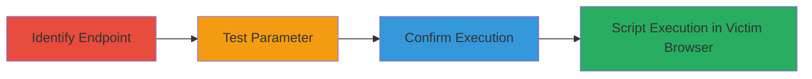

# Reflected XSS via Language Parameter in Glassdoor Help Page

Multi-stage attack chain demonstrating a complete reflected XSS workflow on the Glassdoor help page.

## Chain Metrics Dashboard

| Metric | Value |
|--------|-------|
| Chain Status | Unverified |
| Total Steps | 3 |
| Execution Time | ~5 minutes |
| Skill Level | Intermediate |
| Complexity | Medium |
| Impact Level | High |

## Attack Flow Visualization



## Prerequisites & Requirements

### Required Tools

- Browser developer tools or proxy like Burp Suite

### Target Environment

- Web platform
- Access to public-facing endpoint: https://help.glassdoor.com/gd_requestsubmitpage
- No authentication required

### Initial Access Requirements

- Public internet access
- Ability to craft and send HTTP requests
- Victim tricked into clicking malicious URL (e.g., via phishing)

## Detailed Attack Procedures

### Step 1: Identify Vulnerable Endpoint
procedure: [[procedures/Identify-Vulnerable-Endpoint-for-XSS]]

**Objective**: Examine the target endpoint to identify input parameters susceptible to injection flaws.

**Instructions**: Navigate to or request the endpoint https://help.glassdoor.com/gd_requestsubmitpage and inspect the URL parameters, focusing on user-controlled inputs like 'lang'.

**Expected Output**: Confirmation of the endpoint and its parameters.

**Success Indicators**:
- Endpoint responds with a form or page that echoes parameters
- 'lang' parameter observed in the request/response

### Step 2: Test Lang Parameter for Reflected XSS
procedure: [[procedures/Test-Lang-Parameter-for-Reflected-XSS]]

**Objective**: Inject a test payload into the 'lang' parameter to check for unsanitized reflection.

**Instructions**: Use [[commands/curl-xss-test-lang]] to send a request with a benign payload like <script>alert('XSS')</script> in the 'lang' parameter:

```bash
curl "https://help.glassdoor.com/gd_requestsubmitpage?lang=<script>alert('XSS')</script>"
```

Observe the response for reflection of the payload.

**Expected Output**: Payload appears in the HTML response without encoding.

**Success Indicators**:
- Payload reflected in page source
- No sanitization (e.g., no HTML entities)

### Step 3: Confirm XSS Payload Execution
procedure: [[procedures/Confirm-XSS-Payload-Execution]]

**Objective**: Verify that the reflected payload executes JavaScript in the browser context.

**Instructions**: Load the malicious URL in a browser, such as https://help.glassdoor.com/gd_requestsubmitpage?lang=<script>alert(document.cookie)</script>, and check for alert popup or console execution.

**Expected Output**: JavaScript alert or logged data from the page.

**Success Indicators**:
- Alert box appears
- Access to document.cookie or other DOM elements confirmed

## Attack Chain Summary

### Key Achievements

1. Identified vulnerable 'lang' parameter on Glassdoor help page
2. Demonstrated reflection of arbitrary JavaScript
3. Enabled potential session hijacking or data theft via victim browser execution

## Technique & Tactic Coverage

### MITRE ATT&CK Techniques

- [[Exploit Public-Facing Application]]
- [[JavaScript]]

### MITRE ATT&CK Tactics

- [[Initial Access]]
- [[Execution]]

---
*Last updated: 2023-10-01T00:00:00Z*
