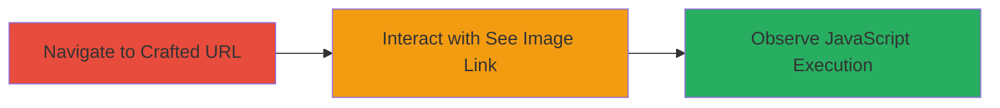

# Reflected XSS via Malicious Data URI in Instacart Partner Recipe Image URL

Multi-stage attack chain demonstrating a complete reflected XSS workflow on the Instacart partner_recipe endpoint.

## Chain Metrics Dashboard

| Metric | Value |
|--------|-------|
| Chain Status | Unverified |
| Total Steps | 3 |
| Execution Time | ~2 minutes |
| Skill Level | Intermediate |
| Complexity | Medium |
| Impact Level | High |

## Attack Flow Visualization



## Prerequisites & Requirements

### Required Tools

- [[tools/Firefox]]
- [[tools/Chrome]]

### Target Environment

- Web platform
- Access to https://www.instacart.com/store/partner_recipe endpoint
- No authentication required for public access

### Initial Access Requirements

- Internet connectivity
- Victim must visit the crafted URL and interact with the image link
- No prior credentials needed

## Detailed Attack Procedures

### Step 1: Navigate to Vulnerable Endpoint with Crafted URL
procedure: [[procedures/Inject-Malicious-Data-URI-for-XSS]]

**Objective**: Deliver the malicious payload via the image_url parameter to set up the reflected XSS.

**Instructions**: Open a web browser and navigate to the following crafted URL, which includes the base64-encoded data URI payload in the image_url parameter:

```url
https://www.instacart.com/store/partner_recipe?recipe_url=http://&partner_name=&ingredients[]=apples&ingredients[]=butter&ingredients[]=Splenda+Brown+Sugar+Blend&ingredients[]=cinnamon&ingredients[]=nutmeg&title="Barb%27s+Fried+Apples+-Diabetic-Low+Fat&description=&image_url=data%3atext%2fhtml%3bbase64%2cPHNjcmlwdD5hbGVydCgieHNzIik8L3NjcmlwdD4
```

The payload is `data:text/html;base64,PHNjcmlwdD5hbGVydCgieHNzIik8L3NjcmlwdD4`, which decodes to `<script>alert('xss')</script>`.

**Expected Output**: The page loads with recipe details, including a 'See Image' link that references the malicious data URI.

**Success Indicators**:
- Page loads without errors
- 'See Image' link is visible on the page

### Step 2: Interact with the 'See Image' Link
procedure: [[procedures/Inject-Malicious-Data-URI-for-XSS]]

**Objective**: Trigger the payload execution by loading the malicious data URI.

**Instructions**: On the loaded page, locate the 'See Image' link associated with the image_url parameter. Right-click the link and select 'Open in New Window' or 'Open Link in New Tab', or directly interact with it to load the image source.

This action causes the browser to interpret the data URI as HTML and execute the embedded script.

**Expected Output**: The new window or tab attempts to load the data URI, rendering it as executable content.

**Success Indicators**:
- New window/tab opens with the malicious content
- No blocking by browser security (e.g., CSP if absent)

### Step 3: Observe XSS Execution
procedure: [[procedures/Inject-Malicious-Data-URI-for-XSS]]

**Objective**: Confirm arbitrary JavaScript execution in the victim's browser context.

**Instructions**: Upon loading the data URI, the script executes automatically. In this proof-of-concept, an alert dialog should appear.

For real-world exploitation, replace the alert with code to steal session cookies (e.g., `document.cookie`) or perform other client-side attacks.

**Expected Output**: Alert popup displaying 'xss'.

**Success Indicators**:
- JavaScript alert triggers
- Console logs or network requests if extended payload used
- Potential for session data exfiltration in advanced scenarios

## Attack Chain Summary

### Key Achievements

1. Successful injection of a reflected XSS payload via data URI in image_url parameter
2. Triggering of JavaScript execution through user interaction with the 'See Image' link
3. Demonstration of arbitrary code execution, enabling session hijacking or data theft

## Technique & Tactic Coverage

### MITRE ATT&CK Techniques

- [[JavaScript]]

### MITRE ATT&CK Tactics

- [[Execution]]
- [[Collection]]

---

*Last updated: 2023-10-01T00:00:00Z*
