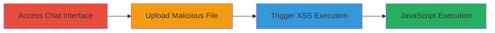

---
tags:
  - xss
  - reflected-xss
  - file-upload
  - shopify
  - javascript-execution
type: attack_chain
tools: []
tactics:
  - '[[Execution]]'
verified: false
platforms:
  - Web
submitted: true
complexity: low
created_at: '2024-10-01T00:00:00Z'
procedures:
  - '[[procedures/Access-Shopify-Live-Chat-Interface]]'
  - '[[procedures/Upload-File-with-Malicious-Filename]]'
  - '[[procedures/Trigger-Reflected-XSS-in-Error-Message]]'
step_count: 3
techniques:
  - '[[JavaScript]]'
updated_at: '2025-12-14T03:15:41.635Z'
description: >-
  A multi-step attack exploiting a reflected XSS vulnerability in Shopify's live
  chat file upload feature by using a malicious filename to inject and execute
  JavaScript in the error message.
skill_level: intermediate
impact_level: high
id: a397bfa0-0e18-4a68-8270-795052a44668
validated: true
mitre_tactics:
  - '[[Execution]]'
mitre_techniques:
  - '[[JavaScript]]'
---
# Reflected XSS via Malicious Filename in Shopify Live Chat File Upload

Multi-stage attack chain demonstrating a complete attack workflow exploiting unsanitized filename reflection in Shopify's live chat error messages to achieve arbitrary JavaScript execution.

## Chain Metrics Dashboard

| Metric | Value |
|--------|-------|
| Chain Status | Unverified |
| Total Steps | 3 |
| Execution Time | ~2 minutes |
| Skill Level | Intermediate |
| Complexity | Low |
| Impact Level | High |

## Attack Flow Visualization

## Prerequisites & Requirements

### Required Tools

- Web browser (e.g., Chrome, Firefox)

### Target Environment

- Web platform
- Access to Shopify live chat at http://livechat.shopify.com/
- No specific ports or services beyond standard HTTPS

### Initial Access Requirements

- Valid Shopify credentials for authentication
- Direct network access to the live chat URL
- No prior access needed beyond login

## Detailed Attack Procedures

### Step 1: Access Shopify Live Chat Interface
procedure: [[procedures/Access-Shopify-Live-Chat-Interface]]

**Objective**: Authenticate and gain access to the live chat interface to prepare for file upload exploitation.

**Instructions**: Open a web browser and navigate to the Shopify live chat URL. Enter your credentials to log in and access the chat session.

**Expected Output**: Successful login with the chat interface loaded, ready for interactions like file uploads.

**Success Indicators**:
- Chat window is active and authenticated
- File upload option is visible in the chat controls

### Step 2: Upload File with Malicious Filename
procedure: [[procedures/Upload-File-with-Malicious-Filename]]

**Objective**: Attempt to upload a file using a filename containing an XSS payload to trigger the vulnerable error handling.

**Instructions**: In the chat interface, select the file upload feature and choose a benign file (e.g., a text file). Rename it to include a payload like `` or `<svg onload="alert('xx')>"`. Submit the upload, ensuring the file type is not allowed (e.g., not jpg, jpeg, gif, png) to invoke the error message.

**Expected Output**: Upload rejection with an error message displaying the filename.

**Success Indicators**:
- Error message appears mentioning the disallowed file type
- Filename is echoed in the message without sanitization

### Step 3: Trigger Reflected XSS in Error Message
procedure: [[procedures/Trigger-Reflected-XSS-in-Error-Message]]

**Objective**: Observe and confirm the execution of the injected JavaScript payload within the reflected error message.

**Instructions**: Review the error message, which renders the payload as HTML, such as 'You are not allowed to upload '' files, allowed types: jpg, jpeg, gif, png'. The onerror attribute triggers the alert(1) or similar execution in the browser context.

**Expected Output**: JavaScript alert box or console execution confirming payload success.

**Success Indicators**:
- Alert dialog pops up with the payload message
- Browser console logs the execution
- Potential for further JS actions like session hijacking

## Attack Chain Summary

### Key Achievements

1. Successful authentication into the vulnerable chat interface
2. Injection of XSS payload via disallowed file upload
3. Arbitrary JavaScript execution in the authenticated session context, enabling client-side attacks like data exfiltration or session manipulation

## Technique & Tactic Coverage

### MITRE ATT&CK Techniques

- [[JavaScript]]

### MITRE ATT&CK Tactics

- [[Execution]]

---
*Last updated: 2024-10-01T00:00:00Z*
