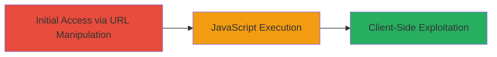

---
tags:
  - xss
  - reflected-xss
  - javascript-injection
  - web-vulnerability
type: attack_chain
tools: []
tactics:
  - '[[Execution]]'
verified: false
platforms:
  - Web
submitted: true
complexity: low
created_at: '2023-10-01T00:00:00Z'
procedures:
  - '[[procedures/Inject-JavaScript-into-Metro-Parameter-for-XSS]]'
step_count: 1
techniques:
  - '[[JavaScript]]'
updated_at: '2025-12-14T03:15:41.432Z'
description: >-
  A single-stage attack demonstrating a reflected XSS vulnerability on
  zomato.com by injecting JavaScript into the 'metro' URL parameter, leading to
  arbitrary code execution in the victim's browser.
skill_level: beginner
impact_level: high
id: 756aafff-048f-49f8-bbae-f45a6c509fd8
validated: true
mitre_tactics:
  - '[[Execution]]'
mitre_techniques:
  - '[[JavaScript]]'
---
# Reflected XSS via Malicious Injection in Metro URL Parameter on Zomato.com

Multi-stage attack chain demonstrating a complete attack workflow.

## Chain Metrics Dashboard

| Metric | Value |
|--------|-------|
| Chain Status | Unverified |
| Total Steps | 1 |
| Execution Time | ~1 minutes |
| Skill Level | Beginner |
| Complexity | Low |
| Impact Level | High |

## Attack Flow Visualization



## Prerequisites & Requirements

### Required Tools

- Web browser (e.g., Chrome)

### Target Environment

- Web platform
- Publicly accessible zomato.com
- No specific services/ports required beyond HTTP/HTTPS

### Initial Access Requirements

- No credentials needed
- Direct network access to the internet
- No prior access required

## Detailed Attack Procedures

### Step 1: URL Parameter Manipulation for XSS Injection
procedure: [[procedures/Inject-JavaScript-into-Metro-Parameter-for-XSS]]

**Objective**: Inject a malicious JavaScript payload into the 'metro' URL parameter to trigger reflected XSS, executing arbitrary code in the browser.

**Instructions**: Construct a malicious URL by appending the payload to the 'metro' parameter. For example, use the base URL https://www.zomato.com/doha/drinks-and-nightlife-in-al-ghanim and inject the payload '-prompt('XSS')-' as follows:

Navigate to: https://www.zomato.com/doha/drinks-and-nightlife-in-al-ghanim?metro='-prompt('XSS')-'

This can be done manually in a browser address bar or via a tool like curl for testing:

```bash
curl "https://www.zomato.com/doha/drinks-and-nightlife-in-al-ghanim?metro='-prompt('XSS')-'"
```

**Expected Output**: Upon loading the page in a browser, a JavaScript prompt dialog appears displaying 'XSS', confirming execution.

**Success Indicators**:
- Prompt dialog pops up on page load
- JavaScript executes even in modern browsers like Chrome

## Attack Chain Summary

### Key Achievements

1. Successful injection and execution of JavaScript via URL parameter
2. Demonstration of reflected XSS leading to potential client-side attacks
3. Identification of insufficient input sanitization in the 'metro' parameter

## Technique & Tactic Coverage

### MITRE ATT&CK Techniques

- [[JavaScript]]

### MITRE ATT&CK Tactics

- [[Execution]]

---
*Last updated: 2023-10-01T00:00:00Z*
