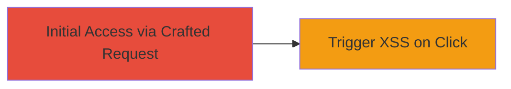

# Reflected XSS via Malicious Referer Header in Apache 404 Error Page

Multi-stage attack chain demonstrating a complete attack workflow.

## Chain Metrics Dashboard

| Metric | Value |
|--------|-------|
| Chain Status | Unverified |
| Total Steps | 1 |
| Execution Time | ~1 minute |
| Skill Level | Beginner |
| Complexity | Low |
| Impact Level | Low |

## Attack Flow Visualization



## Prerequisites & Requirements

### Required Tools

- None (uses standard HTTP client like curl or browser)

### Target Environment

- Web platform with Apache 2.4.10 or similar
- Linux/SUSE-based server
- Access to send HTTP requests to the target domain (e.g., doc.owncloud.org)

### Initial Access Requirements

- No credentials required
- Direct network access to the target endpoint
- Ability to control the Referer header (e.g., via curl or proxy)
- Victim interaction needed (clicking the reflected link)

## Detailed Attack Procedures

### Step 1: Craft Malicious Request to Trigger Reflected XSS
procedure: [[procedures/Exploit-Reflected-XSS-in-Referer-Header]]

**Objective**: Send a crafted GET request to a non-existent endpoint like /promote/ with a malicious javascript: Referer header, causing the Apache 404 page to reflect it as a clickable link that executes JavaScript upon click.

**Instructions**: Use a tool like curl to simulate the request with a custom Referer header. This generates a 404 response where the Referer is reflected unsafely.

First, execute [[commands/curl-malicious-referer-xss]] to send the request:

```bash
curl -H "Referer: javascript:alert('XSS')" -X GET http://doc.owncloud.org/promote/
```

Inspect the response to confirm the 404 page includes a link like "referring page" pointing to the javascript: URI. To exploit, trick a victim into visiting the endpoint (e.g., via phishing) while controlling their Referer (requires user agent manipulation or non-standard setup).

**Expected Output**: HTTP 404 response with body containing: "The referring page: <a href=\"javascript:alert('XSS')\">javascript:alert('XSS')</a>".

**Success Indicators**:
- 404 page received with reflected Referer as clickable link
- Upon clicking the link in a browser, JavaScript alert('XSS') triggers
- No server-side errors; reflection confirmed via response inspection

## Attack Chain Summary

### Key Achievements

1. Successful reflection of malicious Referer in Apache 404 page
2. Potential JavaScript execution with high user interaction (click required)
3. Identification of low-impact XSS due to Referer limitations

## Technique & Tactic Coverage

### MITRE ATT&CK Techniques

- [[Exploit Public-Facing Application]]

### MITRE ATT&CK Tactics

- [[Initial Access]]

---

*Last updated: 2023-10-01T00:00:00Z*
