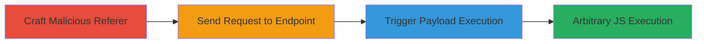

---
tags:
  - xss
  - referer
  - javascript
  - web
  - owncloud
type: attack_chain
tools:
  - '[[tools/sec101-referer-xss-poc]]'
tactics:
  - '[[Initial Access]]'
  - '[[Execution]]'
commands:
  - '[[commands/curl-send-referer-xss]]'
verified: false
platforms:
  - Web
submitted: true
complexity: medium
created_at: '2023-10-01T00:00:00Z'
procedures:
  - '[[procedures/Craft-Malicious-Referer-Header-for-XSS]]'
  - '[[procedures/Send-Request-to-Vulnerable-ownCloud-Endpoint]]'
  - '[[procedures/Trigger-and-Observe-XSS-Payload-Execution]]'
step_count: 3
techniques:
  - '[[Exploit Public-Facing Application]]'
  - '[[JavaScript]]'
updated_at: '2025-12-14T03:16:08.026Z'
description: >-
  A multi-step attack exploiting a reflected XSS vulnerability in
  apps.owncloud.com by injecting JavaScript via the HTTP Referer header into an
  onclick attribute, leading to arbitrary code execution in the victim's
  browser.
skill_level: intermediate
impact_level: high
id: bd4e281f-8a16-482d-a850-7b9d47135a65
validated: true
mitre_tactics:
  - '[[Initial Access]]'
  - '[[Execution]]'
mitre_techniques:
  - '[[Exploit Public-Facing Application]]'
  - '[[JavaScript]]'
---
# Reflected XSS via Malicious Referer Header in ownCloud Apps

Multi-stage attack chain demonstrating exploitation of a reflected XSS vulnerability in apps.owncloud.com, where the HTTP Referer header is unsafely reflected into an onclick attribute of a cancel button, allowing JavaScript injection. This attack is effective primarily in browsers like Internet Explorer that do not encode the Referer header, enabling session hijacking or data theft upon user interaction with the affected button.

## Chain Metrics Dashboard

| Metric | Value |
|--------|-------|
| Chain Status | Unverified |
| Total Steps | 3 |
| Execution Time | ~5 minutes |
| Skill Level | Intermediate |
| Complexity | Medium |
| Impact Level | High |

## Attack Flow Visualization



## Prerequisites & Requirements

### Required Tools

- [[tools/sec101-referer-xss-poc]]
- curl or similar HTTP client

### Target Environment

- Web platform
- PHP-based application (ownCloud apps)
- Vulnerable endpoints like /messages/?action=newmessage&username=
- No specific ports required; standard HTTPS (443)

### Initial Access Requirements

- Ability to send HTTP requests with custom headers (e.g., from attacker's machine)
- Victim must click the affected cancel button in a vulnerable browser (e.g., IE)
- No prior credentials needed; social engineering to trick victim into visiting the endpoint

## Detailed Attack Procedures

### Step 1: Craft Malicious Referer Header
procedure: [[procedures/Craft-Malicious-Referer-Header-for-XSS]]

**Objective**: Create a Referer header containing a JavaScript payload that breaks out of the onclick attribute and executes arbitrary code when reflected.

**Instructions**: Use a proof-of-concept generator or manually craft the Referer URL with a payload like 'http://www.myevilsite.com/qwe';alert(1)+' to inject into the onclick context. For testing, leverage [[tools/sec101-referer-xss-poc]] to generate the full malicious URL.

**Expected Output**: A valid HTTP Referer header string ready for use in requests.

**Success Indicators**:
- Payload URL successfully encodes the XSS without syntax errors
- Validation shows it would break out of string quotes in HTML attributes

### Step 2: Send Request to Vulnerable Endpoint
procedure: [[procedures/Send-Request-to-Vulnerable-ownCloud-Endpoint]]

**Objective**: Deliver the malicious Referer to a vulnerable ownCloud endpoint, causing the server to reflect it in the response.

**Instructions**: Use [[commands/curl-send-referer-xss]] to send a GET request to targets like https://apps.owncloud.com/messages/?action=newmessage&username=anderslund with the crafted Referer header.

```bash
curl -H "Referer: http://www.myevilsite.com/qwe';alert(1)+'" https://apps.owncloud.com/messages/?action=newmessage&username=anderslund
```

**Expected Output**: Server response containing the reflected Referer in an onclick attribute, e.g., onclick="location.href='http://www.myevilsite.com/qwe';alert(1)+'".

**Success Indicators**:
- Response HTML includes the unescaped Referer in the cancel button's onclick
- No server-side errors; page loads normally

### Step 3: Trigger and Observe Payload Execution
procedure: [[procedures/Trigger-and-Observe-XSS-Payload-Execution]]

**Objective**: Interact with the reflected page in a vulnerable browser to execute the injected JavaScript, confirming arbitrary code execution.

**Instructions**: Load the response page in a browser like Internet Explorer (which sends unencoded Referer) and click the cancel button to trigger the onclick event.

**Expected Output**: JavaScript alert or other payload effects, such as document.domain alert, confirming execution.

**Success Indicators**:
- Alert box pops up with payload content
- Potential access to session cookies or DOM manipulation observed

## Attack Chain Summary

### Key Achievements

1. Successful injection of JavaScript via Referer header
2. Reflection into onclick attribute without escaping
3. Arbitrary code execution upon user interaction, limited to non-encoding browsers

## Technique & Tactic Coverage

### MITRE ATT&CK Techniques

- [[Exploit Public-Facing Application]]
- [[JavaScript]]

### MITRE ATT&CK Tactics

- [[Initial Access]]
- [[Execution]]

---

*Last updated: 2023-10-01T00:00:00Z*
