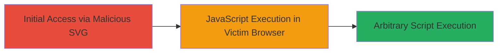

# Reflected XSS via Malicious SVG Files on Autodesk AREA Server

Multi-stage attack chain demonstrating a complete attack workflow exploiting a reflected XSS vulnerability in SVG files on the Autodesk AREA staging server.

## Chain Metrics Dashboard

| Metric | Value |
|--------|-------|
| Chain Status | Unverified |
| Total Steps | 1 |
| Execution Time | ~5 minutes |
| Skill Level | Intermediate |
| Complexity | Low |
| Impact Level | High |

## Attack Flow Visualization



## Prerequisites & Requirements

### Required Tools

- Web browser for testing (e.g., Chrome with developer tools)
- Text editor for crafting SVG payloads

### Target Environment

- Web platform
- Autodesk AREA server at area-resources-stg.autodesk.com
- Access to upload or reference SVG files

### Initial Access Requirements

- Ability to host or reference a malicious SVG file
- Victim interaction by viewing the SVG on the server
- No authentication required for public-facing resources

## Detailed Attack Procedures

### Step 1: Inject and Trigger XSS Payload
procedure: [[procedures/Inject-Malicious-JavaScript-into-SVG-File]]

**Objective**: Craft and deliver a malicious SVG file containing reflected XSS payload to execute arbitrary JavaScript when viewed by a victim on the Autodesk AREA server.

**Instructions**: Create an SVG file with an embedded JavaScript payload that exploits the lack of sanitization. Upload or reference it on the server, then trick a victim into viewing it. Use a browser to test the payload execution.

For example, embed a script tag in the SVG:

```xml
<svg xmlns="http://www.w3.org/2000/svg" onload="alert('XSS Executed')">
  <script>console.log('Malicious script running');</script>
</svg>
```

Host this SVG and access it via the vulnerable endpoint on area-resources-stg.autodesk.com to reflect the payload.

**Expected Output**: Alert box or console log appears in the victim's browser upon viewing the SVG, confirming JavaScript execution.

**Success Indicators**:
- JavaScript alert or log triggers in browser
- Arbitrary code (e.g., cookie theft) executes without errors

## Attack Chain Summary

### Key Achievements

1. Successful injection of JavaScript into SVG files without sanitization
2. Execution of arbitrary scripts in the context of the victim's browser session
3. Potential for data exfiltration or session hijacking on Autodesk AREA platform

## Technique & Tactic Coverage

### MITRE ATT&CK Techniques

- [[Exploit Public-Facing Application]]
- [[JavaScript]]

### MITRE ATT&CK Tactics

- [[Initial Access]]
- [[Execution]]

---
*Last updated: 2023-10-01T12:00:00Z*
