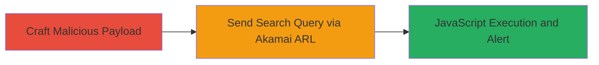

# Reflected XSS via Malicious Search Query in Akamai ARL

Multi-stage attack chain demonstrating a complete attack workflow.

## Chain Metrics Dashboard

| Metric | Value |
|--------|-------|
| Chain Status | Unverified |
| Total Steps | 1 |
| Execution Time | ~1 minutes |
| Skill Level | Intermediate |
| Complexity | Low |
| Impact Level | High |

## Attack Flow Visualization



## Prerequisites & Requirements

### Required Tools

- Browser or [[commands/curl-send-xss-payload]]

### Target Environment

- Web platform with Akamai ARL integration
- Publicly accessible DoD website endpoint (e.g., http://████/7/0/33/1d/)
- No authentication required

### Initial Access Requirements

- Internet access to the target website
- No prior credentials or network position needed; attack is remote and unauthenticated

## Detailed Attack Procedures

### Step 1: Craft and Send Malicious Search Query
procedure: [[procedures/Exploit-Reflected-XSS-in-Akamai-ARL]]

**Objective**: Trigger reflected XSS by injecting a JavaScript payload into the search 'where' parameter, leading to arbitrary code execution in the victim's browser context.

**Instructions**: Access the target DoD endpoint and append the vulnerable search URL with the XSS payload. Use a browser to visit the full URL or simulate with [[commands/curl-send-xss-payload]]:

```bash
curl "http://████/7/0/33/1d/www.citysearch.com/search?what=Binit&where=Binit%22%3E%3Cimg%20src%3Dbinit%20onerror%3Dalert%28document.domain%29%3E" -v
```

The payload in the 'where' parameter (`Binit%22%3E%3Cimg%20src%3Dbinit%20onerror%3Dalert%28document.domain%29%3E`) breaks out of the expected input context and injects an `` tag that executes `alert(document.domain)` on error.

**Expected Output**: The response reflects the payload, and in a browser, an alert box pops up displaying the document domain, confirming XSS execution.

**Success Indicators**:
- Alert dialog appears with the domain name
- JavaScript console shows execution errors or alerts
- No server-side errors; payload is reflected client-side

## Attack Chain Summary

### Key Achievements

1. Successful injection and reflection of XSS payload via Akamai ARL search feature
2. Arbitrary JavaScript execution in the context of the DoD website
3. Potential for session hijacking or data theft demonstrated through alert

## Technique & Tactic Coverage

### MITRE ATT&CK Techniques

- [[Exploit Public-Facing Application]]
- [[JavaScript]]

### MITRE ATT&CK Tactics

- [[Execution]]
- [[Collection]]

---
*Last updated: 2023-10-01T00:00:00Z*
