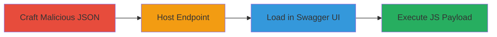

# Reflected XSS via Malicious Swagger UI Specification on Zomato Developers Portal

Multi-stage attack chain demonstrating a complete reflected XSS workflow targeting an outdated Swagger UI implementation.

## Chain Metrics Dashboard

| Metric | Value |
|--------|-------|
| Chain Status | Unverified |
| Total Steps | 3 |
| Execution Time | ~10 minutes |
| Skill Level | Intermediate |
| Complexity | Medium |
| Impact Level | High |

## Attack Flow Visualization

## Prerequisites & Requirements

### Required Tools

- Text editor for JSON modification
- Web server for hosting (e.g., Python's SimpleHTTPServer)

### Target Environment

- Web platform with access to https://developers.zomato.com/documentation
- Vulnerable old version of Swagger UI

### Initial Access Requirements

- No credentials required
- Public network access to the target documentation page
- Ability to host a public endpoint for the malicious JSON

## Detailed Attack Procedures

### Step 1: Craft Malicious Swagger JSON
procedure: [[procedures/Craft-Malicious-Swagger-JSON]]

**Objective**: Inject an XSS payload into the Swagger API specification JSON to enable JavaScript execution during rendering.

**Instructions**: Start with a base Swagger JSON file, such as the sample Petstore spec. Modify the 'Pet' definition by injecting the payload into a field like 'photoUrls', appending the script tag directly to create 'photoUrls'. Save the file as a valid JSON.

**Expected Output**: A modified JSON file containing the injected payload that remains parsable by Swagger UI.

**Success Indicators**:
- JSON validates without syntax errors
- Payload is embedded in a renderable property

### Step 2: Host Malicious Swagger Endpoint
procedure: [[procedures/Host-Malicious-Swagger-Endpoint]]

**Objective**: Serve the malicious JSON from an accessible endpoint that Swagger UI can load.

**Instructions**: Use a simple web server to host the JSON file. For example, place the file at a path like /api-docs and ensure it's publicly accessible via HTTP. Note the full URL of the endpoint.

**Expected Output**: The JSON is retrievable via HTTP GET from the hosted URL.

**Success Indicators**:
- Endpoint responds with the malicious JSON
- No server errors on access

### Step 3: Trigger XSS in Vulnerable Swagger UI
procedure: [[procedures/Trigger-XSS-in-Vulnerable-Swagger-UI]]

**Objective**: Load the malicious spec into the target Swagger UI, causing the payload to execute in the victim's browser.

**Instructions**: Navigate to https://developers.zomato.com/documentation. Configure the Swagger UI to load the spec from the hosted malicious endpoint URL. The UI will parse and render the JSON, executing the injected JavaScript to display an alert with cookies or perform other actions like data exfiltration.

**Expected Output**: JavaScript execution, such as an alert box showing document cookies.

**Success Indicators**:
- Payload executes (e.g., alert fires)
- Access to victim cookies or session data

## Attack Chain Summary

### Key Achievements

1. Successful injection of XSS payload into Swagger JSON without breaking spec validity
2. Hosting and serving of the malicious spec for remote loading
3. Reflection and execution of arbitrary JavaScript in the browser context of the Zomato developers page

## Technique & Tactic Coverage

### MITRE ATT&CK Techniques

- [[JavaScript]]

### MITRE ATT&CK Tactics

- [[Execution]]
- [[Collection]]

---
*Last updated: 2023-10-01T00:00:00Z*
