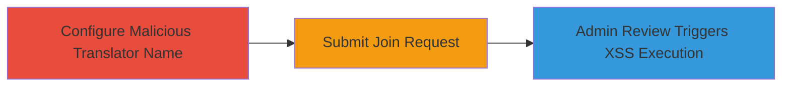

# Reflected XSS via Malicious Translator Name in Localize Project Invite Approval

Multi-stage attack chain demonstrating a complete attack workflow exploiting insufficient input sanitization in the translator name field during project invite reviews.

## Chain Metrics Dashboard

| Metric | Value |
|--------|-------|
| Chain Status | Unverified |
| Total Steps | 3 |
| Execution Time | ~5 minutes |
| Skill Level | Intermediate |
| Complexity | Medium |
| Impact Level | High |

## Attack Flow Visualization

## Prerequisites & Requirements

### Required Tools

- Web browser (e.g., Chrome with developer tools for payload testing)

### Target Environment

- Localize platform (web application)
- Access to create a translator account
- No specific ports or services beyond standard HTTPS (443)

### Initial Access Requirements

- Valid user account on Localize with translator permissions
- Knowledge of a target project to request joining
- Admin privileges on the target project (for the victim side, simulated or social-engineered)

## Detailed Attack Procedures

### Step 1: Configure Malicious Translator Name
procedure: [[procedures/Configure-Malicious-Translator-Name-for-XSS]]

**Objective**: Inject a malicious JavaScript payload into the translator's profile name field to prepare for XSS reflection.

**Instructions**: Log in to your Localize translator account. Navigate to your profile settings and update the 'name' field with the payload `"><svg onload="prompt(/xss/);">`. Save the changes. This payload closes any open HTML tags and injects an SVG element that executes JavaScript on load.

**Expected Output**: Profile updated successfully; the name now contains the unsanitized payload.

**Success Indicators**:
- Profile name reflects the injected payload when viewed in source
- No immediate errors or sanitization applied

### Step 2: Submit Malicious Project Join Request
procedure: [[procedures/Submit-Malicious-Project-Join-Request]]

**Objective**: Send a join request for a target project, embedding the malicious name in the pending invites list.

**Instructions**: From your translator dashboard, search for and select the target project. Click 'Request to Join' or equivalent. The request submits with the tainted name included in the data sent to the server.

**Expected Output**: Join request submitted; confirmation message or pending status shown.

**Success Indicators**:
- Request appears in the project's pending invites (verifiable if you have alternate access)
- No server-side rejection of the payload

### Step 3: Trigger XSS Execution via Admin Review
procedure: [[procedures/Trigger-XSS-Execution-via-Admin-Review]]

**Objective**: Cause the admin to render the payload, executing arbitrary JavaScript in their browser context.

**Instructions**: Notify or wait for the project admin to review pending invites. When the admin clicks on the review link for your request, the interface displays the unsanitized translator name, loading the SVG and triggering the onload event to execute `prompt(/xss/)`, confirming XSS.

**Expected Output**: In the admin's browser, a prompt dialog appears with 'xss', indicating successful execution.

**Success Indicators**:
- Alert or prompt fires in the victim's browser
- Potential for further payloads to steal cookies or session data

## Attack Chain Summary

### Key Achievements

1. Successful injection of XSS payload via user-controlled translator name
2. Reflection and execution in admin's privileged context without authentication bypass
3. Demonstration of high-impact risks like session hijacking or data exfiltration

## Technique & Tactic Coverage

### MITRE ATT&CK Techniques

- [[JavaScript]]

### MITRE ATT&CK Tactics

- [[Execution]]
- [[Collection]]

---
*Last updated: 2024-10-01T00:00:00Z*
