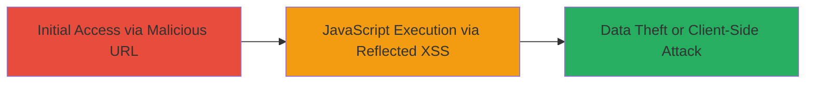

---
tags:
  - xss
  - akamai-arl
  - reflected-xss
  - dod
type: attack_chain
tools:
  - '[[tools/goarl]]'
tactics:
  - '[[Initial Access]]'
  - '[[Execution]]'
  - '[[Collection]]'
verified: false
platforms:
  - Web
submitted: true
complexity: medium
created_at: '2024-01-01T00:00:00Z'
procedures:
  - '[[procedures/Inject-XSS-Payload-via-Akamai-ARL-Search]]'
step_count: 1
techniques:
  - '[[Exploit Public-Facing Application]]'
  - '[[JavaScript]]'
updated_at: '2025-12-14T03:16:25.972Z'
description: >-
  A reflected XSS attack exploiting an open Akamai ARL configuration on a DoD
  website, allowing JavaScript execution through unsanitized search parameters
  reflected from www.citysearch.com.
skill_level: intermediate
impact_level: high
id: aa53588d-689c-4ac8-82c9-05f9e4370a63
validated: true
mitre_tactics:
  - '[[Initial Access]]'
  - '[[Execution]]'
  - '[[Collection]]'
mitre_techniques:
  - '[[Exploit Public-Facing Application]]'
  - '[[JavaScript]]'
---
# Reflected XSS via Open Akamai ARL Configuration on DoD Website

Multi-stage attack chain demonstrating a complete attack workflow exploiting an open Akamai ARL setup on a U.S. Department of Defense website.

## Chain Metrics Dashboard

| Metric | Value |
|--------|-------|
| Chain Status | Unverified |
| Total Steps | 1 |
| Execution Time | ~1 minutes |
| Skill Level | Intermediate |
| Complexity | Medium |
| Impact Level | High |

## Attack Flow Visualization



## Prerequisites & Requirements

### Required Tools

- [[tools/goarl]]

### Target Environment

- Web platform with Akamai CDN
- Services: Akamai ARL enabled without sanitization
- Tech stack: Akamai CDN
- Network access: Public internet access to the DoD site and embedded search endpoint

### Initial Access Requirements

- No credentials required
- Victim must visit the crafted malicious URL on the DoD site
- Prior access: None, as it's a drive-by compromise via reflected payload

## Detailed Attack Procedures

### Step 1: Inject XSS Payload into Akamai ARL Search Parameter
procedure: [[procedures/Inject-XSS-Payload-via-Akamai-ARL-Search]]

**Objective**: Craft and deliver a malicious URL that injects an XSS payload into the 'where' parameter of the www.citysearch.com search endpoint, processed through the open Akamai ARL on the DoD site, leading to JavaScript execution in the victim's browser.

**Instructions**: Construct the target URL by appending the search query with the XSS payload to the DoD site's vulnerable path. The payload breaks out of the parameter context and injects an HTML element that executes JavaScript on error. Use a browser or [[commands/curl-xss-test]] to access the URL and verify execution.

```bash
curl "https://█████████/7/0/33/1d/?search=www.citysearch.com/search?what=Binit&where=Binit%22%3E%3Cimg%20src%3Dbinit%20onerror%3Dalert%28document.domain%29%3E"
```

Alternatively, navigate directly in a browser to: https://█████████/7/0/33/1d/ which embeds or links to www.citysearch.com/search?what=Binit&where=Binit">

**Expected Output**: The response reflects the payload unsanitized, rendering the  tag that triggers the onerror event, executing alert(document.domain) and displaying the domain name.

**Success Indicators**:
- Alert box pops up showing the document domain (e.g., the DoD site's domain)
- Browser console logs JavaScript execution without errors
- No sanitization of the payload in the HTML response source

## Attack Chain Summary

### Key Achievements

1. Successful reflection of XSS payload through Akamai ARL without sanitization
2. Arbitrary JavaScript execution in the context of the DoD website
3. Potential for session hijacking, cookie theft, or phishing via client-side attacks

## Technique & Tactic Coverage

### MITRE ATT&CK Techniques

- [[Exploit Public-Facing Application]]
- [[JavaScript]]

### MITRE ATT&CK Tactics

- [[Initial Access]]
- [[Execution]]
- [[Collection]]

---
*Last updated: 2024-01-01T00:00:00Z*
