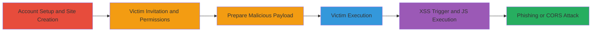

# Reflected XSS via POST txtCode Parameter in IntenseDebate Tumblr2 Update for Phishing Attacks

Multi-stage attack chain demonstrating a complete workflow to exploit a reflected cross-site scripting (XSS) vulnerability in the IntenseDebate platform. The attack requires an attacker-controlled account to set up a site, invite a victim with full permissions, and trick the victim into loading a malicious HTML file that submits an unsanitized payload to the vulnerable endpoint, resulting in JavaScript execution for phishing or CORS manipulation.

## Chain Metrics Dashboard

| Metric | Value |
|--------|-------|
| Chain Status | Unverified |
| Total Steps | 6 |
| Execution Time | ~15 minutes |
| Skill Level | Intermediate |
| Complexity | Medium |
| Impact Level | High |

## Attack Flow Visualization

## Prerequisites & Requirements

### Required Tools

- Web browser (e.g., Chrome, Firefox)
- Text editor (e.g., Notepad++, VS Code)

### Target Environment

- IntenseDebate platform (https://www.intensedebate.com)
- Web-based service running PHP
- No specific ports required beyond standard HTTPS (443)

### Initial Access Requirements

- Attacker credentials for IntenseDebate account
- Victim credentials (or social engineering to obtain/trick victim)
- Local network access to load HTML file (no remote network position needed)

## Detailed Attack Procedures

### Step 1: Attacker Login
procedure: [[procedures/Login-to-IntenseDebate-as-Attacker]]

**Objective**: Authenticate the attacker account to access site management features.

**Instructions**: Navigate to the IntenseDebate login page and enter attacker credentials to log in.

**Expected Output**: Successful login redirect to the dashboard.

**Success Indicators**:
- Dashboard accessible
- Account permissions confirmed

### Step 2: Create New Site
procedure: [[procedures/Create-New-Site-on-IntenseDebate]]

**Objective**: Establish a controlled site to enable the reinstall functionality for the victim.

**Instructions**: From the dashboard, go to the install section at https://intensedebate.com/install, select the generic install option, and complete the setup process to create a new site. Note the generated site ID.

**Expected Output**: New site created with a unique ID.

**Success Indicators**:
- Site ID obtained
- Reinstall functionality available

### Step 3: Invite Victim and Grant Permissions
procedure: [[procedures/Invite-Victim-and-Grant-Full-Permissions]]

**Objective**: Provide the victim with access to the attacker's site to expose the vulnerable endpoint.

**Instructions**: Use the site's invitation feature to add the victim's email or username, then assign full permissions, including access to reinstall options.

**Expected Output**: Invitation sent and accepted by victim; full permissions granted.

**Success Indicators**:
- Victim listed as collaborator
- Victim can access reinstall functionality

### Step 4: Prepare XSS Payload
procedure: [[procedures/Prepare-XSS-Proof-of-Concept-HTML]]

**Objective**: Craft a local HTML file that submits the malicious payload to the vulnerable endpoint.

**Instructions**: Create or download an xss.html file containing a form that POSTs to https://www.intensedebate.com/update/tumblr2/{site_id} with 'txtCode' parameter set to a payload like ''. Replace {site_id} with the actual ID from Step 2.

**Expected Output**: Local HTML file ready for execution.

**Success Indicators**:
- HTML file saved locally
- Payload embedded correctly

### Step 5: Victim Login and Load Payload
procedure: [[procedures/Login-as-Victim-and-Open-Malicious-HTML]]

**Objective**: Position the victim to trigger the exploit by authenticating and loading the file.

**Instructions**: Log in to IntenseDebate using victim credentials, then open the prepared xss.html file in a browser while authenticated.

**Expected Output**: File loads in browser under victim's session.

**Success Indicators**:
- Victim session active
- HTML file opens without errors

### Step 6: Execute and Verify XSS
procedure: [[procedures/Trigger-and-Observe-XSS-Execution]]

**Objective**: Submit the payload to confirm JavaScript execution and assess impact.

**Instructions**: Interact with the HTML file to submit the POST request; observe the reflected payload execution.

**Expected Output**: Popup alert or JS execution confirming XSS.

**Success Indicators**:
- Alert box appears
- Potential for phishing form or CORS request observed

## Attack Chain Summary

### Key Achievements

1. Bypassed access controls via permissions to expose vulnerable endpoint
2. Delivered payload through social engineering with local HTML file
3. Achieved arbitrary JS execution for phishing or data exfiltration

## Technique & Tactic Coverage

### MITRE ATT&CK Techniques

- [[JavaScript]]

### MITRE ATT&CK Tactics

- [[Execution]]

---
*Last updated: 2023-10-01T00:00:00Z*
