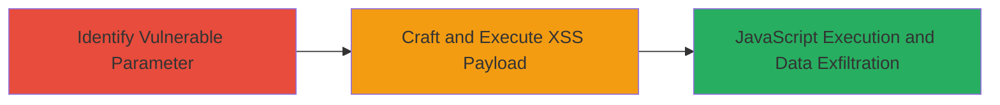

---
tags:
  - xss
  - reflected-xss
  - javascript
  - session-hijacking
type: attack_chain
tools: []
tactics:
  - '[[Execution]]'
verified: false
platforms:
  - Web
submitted: true
complexity: medium
created_at: '2023-10-01T00:00:00Z'
procedures:
  - '[[procedures/Identify-Injectable-Parameter-for-XSS]]'
  - '[[procedures/Craft-and-Test-XSS-Payload]]'
step_count: 2
techniques:
  - '[[JavaScript]]'
updated_at: '2025-12-14T03:47:18.535Z'
description: >-
  A multi-step attack exploiting a reflected XSS vulnerability in the 'page'
  parameter of the MTN Caller Tunes web application, leading to arbitrary
  JavaScript execution and potential session hijacking.
skill_level: intermediate
impact_level: high
id: c3fb3b3c-096e-4613-92c3-f2f2698fd99c
validated: true
mitre_tactics:
  - '[[Execution]]'
mitre_techniques:
  - '[[JavaScript]]'
---
# Reflected XSS via Page Parameter on MTN Caller Tunes Endpoint

Multi-stage attack chain demonstrating exploitation of a reflected Cross-Site Scripting (XSS) vulnerability in the 'page' parameter on the play.mtn.co.za/callertunez endpoint. The attack allows arbitrary JavaScript execution in the victim's browser, potentially leading to theft of session cookies, local storage data, user impersonation, and social engineering via page modifications.

## Chain Metrics Dashboard

| Metric | Value |
|--------|-------|
| Chain Status | Unverified |
| Total Steps | 2 |
| Execution Time | ~5 minutes |
| Skill Level | Intermediate |
| Complexity | Medium |
| Impact Level | High |

## Attack Flow Visualization

## Prerequisites & Requirements

### Required Tools

- Web browser with developer tools (e.g., Chrome DevTools)
- Optional: Proxy tool like Burp Suite for URL encoding and manipulation

### Target Environment

- Web application: https://play.mtn.co.za/callertunez/
- Required services/ports: HTTP/HTTPS on port 80/443
- Network access requirements: Direct internet access to the target URL

### Initial Access Requirements

- No credentials required
- Publicly accessible endpoint
- No prior access needed

## Detailed Attack Procedures

### Step 1: Identify Vulnerable Parameter
procedure: [[procedures/Identify-Injectable-Parameter-for-XSS]]

**Objective**: Locate user-controlled parameters in the URL that reflect input without sanitization, identifying potential XSS injection points.

**Instructions**: Navigate to the target endpoint https://play.mtn.co.za/callertunez/?page=2 and inspect the URL structure. Append test characters like single quotes (') or double quotes (") to the 'page' parameter to check for reflection and breakage of HTML context.

**Expected Output**: The parameter value appears unsanitized in the page source, such as in a script tag or HTML attribute, indicating injection feasibility.

**Success Indicators**:
- Input reflected without encoding
- HTML structure breaks on special characters

### Step 2: Craft and Execute XSS Payload
procedure: [[procedures/Craft-and-Test-XSS-Payload]]

**Objective**: Inject a malicious JavaScript payload into the vulnerable parameter to execute code in the browser context, demonstrating arbitrary script execution.

**Instructions**: URL-encode a simple XSS payload like "> and append it to the 'page' parameter. Access the crafted URL in a browser to trigger execution.

**Expected Output**: An alert box pops up displaying the document domain (e.g., play.mtn.co.za), confirming JavaScript execution.

**Success Indicators**:
- Alert or console log executes
- Ability to access document.cookie or localStorage via payload modification

## Attack Chain Summary

### Key Achievements

1. Identified and confirmed reflected XSS in the 'page' parameter without input validation.
2. Executed arbitrary JavaScript, enabling session token theft and impersonation.
3. Demonstrated potential for social engineering through page defacement.

## Technique & Tactic Coverage

### MITRE ATT&CK Techniques

- [[JavaScript]]

### MITRE ATT&CK Tactics

- [[Execution]]

---
*Last updated: 2023-10-01T00:00:00Z*
