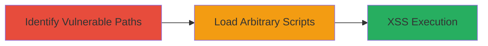

---
tags:
  - xss
  - path-traversal
  - github-pages
  - web-exploit
type: attack_chain
tools: []
tactics:
  - '[[Initial Access]]'
  - '[[Execution]]'
verified: false
platforms:
  - Web
submitted: true
complexity: medium
procedures:
  - '[[procedures/Identify-Vulnerable-URL-Paths-in-GoCD]]'
  - '[[procedures/Load-Arbitrary-Scripts-via-Path-Traversal-for-XSS]]'
step_count: 2
techniques:
  - '[[Exploit Public-Facing Application]]'
  - '[[JavaScript]]'
description: >-
  Multi-stage attack exploiting path traversal in GoCD's URL routing on GitHub
  Pages-hosted sites to enable reflected or stored XSS by loading arbitrary
  JavaScript.
skill_level: intermediate
impact_level: high
id: 6fba162f-6214-4e5e-bb7b-108137985e5d
created_at: '2025-12-14T03:16:30.885Z'
updated_at: '2025-12-14T03:16:30.885Z'
validated: true
mitre_tactics:
  - '[[Initial Access]]'
  - '[[Execution]]'
mitre_techniques:
  - '[[Exploit Public-Facing Application]]'
  - '[[JavaScript]]'
---
# Reflected XSS via Path Traversal in GoCD URL Routing

Multi-stage attack chain demonstrating a complete attack workflow exploiting path traversal in the URL routing of GoCD's websites (www.go.cd and docs.go.cd), hosted on GitHub Pages, to enable reflected or stored XSS attacks.

## Chain Metrics Dashboard

| Metric | Value |
|--------|-------|
| Chain Status | Unverified |
| Total Steps | 2 |
| Execution Time | ~5 minutes |
| Skill Level | Intermediate |
| Complexity | Medium |
| Impact Level | High |

## Attack Flow Visualization



## Prerequisites & Requirements

### Required Tools

- Web browser (e.g., Chrome with developer tools)

### Target Environment

- Target: GoCD websites (www.go.cd, docs.go.cd)
- Platform: Web
- Services: HTTP/HTTPS on port 80/443
- Tech Stack: GitHub Pages hosting

### Initial Access Requirements

- Public internet access
- No authentication required (public-facing sites)
- Ability to craft and navigate to malformed URLs

## Detailed Attack Procedures

### Step 1: Identify Vulnerable URL Paths
procedure: [[procedures/Identify-Vulnerable-URL-Paths-in-GoCD]]

**Objective**: Test and confirm path traversal vulnerabilities in GoCD's URL routing without proper validation.

**Instructions**: Use a web browser to navigate to crafted URLs incorporating path traversal sequences. For example, append traversal payloads to base paths like /user/upoad/.

```plaintext
https://www.go.cd/user/upoad/..%2F..%2F
https://docs.go.cd/current/user/upoad/..%2F..%2F
```

Observe that the server accepts these without redirects or errors, treating them as valid paths.

**Expected Output**: Page loads without 404 or redirect, potentially serving unintended directory content.

**Success Indicators**:
- No error or redirect triggered
- Unexpected content or JavaScript loads from traversed paths

### Step 2: Load Arbitrary Scripts via Path Traversal for XSS
procedure: [[procedures/Load-Arbitrary-Scripts-via-Path-Traversal-for-XSS]]

**Objective**: Demonstrate execution of arbitrary JavaScript by leveraging the path traversal to load user-uploaded or unexpected scripts, enabling XSS.

**Instructions**: Build on the vulnerable paths identified in Step 1. If user-uploaded JavaScript files exist in accessible directories (e.g., via prior uploads or misconfigurations), craft URLs to load them. Monitor network requests and page source for script inclusion.

```plaintext
https://www.go.cd/user/upoad/..%2F..%2Fpath/to/malicious.js
```

Use browser developer tools to inspect loaded resources and confirm script execution, such as alert popups or DOM manipulations indicative of XSS.

**Expected Output**: Arbitrary JavaScript executes in the victim's browser context, as evidenced by console logs, alerts, or network activity.

**Success Indicators**:
- Malicious script loads and runs
- XSS payload (e.g., alert('XSS')) triggers
- Potential compromise of user sessions or data exfiltration

## Attack Chain Summary

### Key Achievements

1. Confirmed path traversal acceptance in GoCD URL routing on GitHub Pages.
2. Enabled loading of unexpected JavaScript files without server-side blocks.
3. Demonstrated potential for reflected/stored XSS impacting GoCD users.

## Technique & Tactic Coverage

### MITRE ATT&CK Techniques

- [[Exploit Public-Facing Application]] Exploit Public-Facing Application
- [[JavaScript]] JavaScript

### MITRE ATT&CK Tactics

- [[Initial Access]] Initial Access
- [[Execution]] Execution

---
*Last updated: 2023-10-01*
