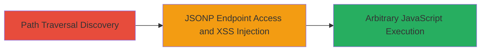

---
tags:
  - xss
  - path-traversal
  - jsonp
  - web-vulnerability
type: attack_chain
tools: []
tactics:
  - '[[Initial Access]]'
  - '[[Execution]]'
verified: false
platforms:
  - Web
submitted: true
complexity: medium
created_at: '2023-10-01T00:00:00Z'
procedures:
  - '[[procedures/Test-Path-Traversal-in-Tags-Parameter]]'
  - '[[procedures/Inject-Malicious-Callback-for-XSS-in-JSONP-Endpoint]]'
step_count: 2
techniques:
  - '[[Exploit Public-Facing Application]]'
  - '[[JavaScript]]'
updated_at: '2025-12-13T23:52:21.087Z'
description: >-
  A multi-stage web attack exploiting path traversal in the tags parameter to
  access an internal JSONP endpoint and inject a malicious callback for
  reflected XSS, enabling arbitrary JavaScript execution in the victim's
  browser.
skill_level: intermediate
impact_level: high
id: b3a3d8c8-9277-4f0e-8315-5ec4a6dad90a
validated: true
mitre_tactics:
  - '[[Initial Access]]'
  - '[[Execution]]'
mitre_techniques:
  - '[[Exploit Public-Facing Application]]'
  - '[[JavaScript]]'
---
# Reflected XSS via Path Traversal in Rockstar Newswire Tags Parameter

Multi-stage attack chain demonstrating exploitation of insufficient input sanitization in the Rockstar Games newswire tags functionality. The attack begins with path traversal to access internal endpoints and culminates in reflected XSS via a malicious JSONP callback, allowing arbitrary JavaScript execution such as alerting the document domain or stealing session cookies.

## Chain Metrics Dashboard

| Metric | Value |
|--------|-------|
| Chain Status | Unverified |
| Total Steps | 2 |
| Execution Time | ~5 minutes |
| Skill Level | Intermediate |
| Complexity | Medium |
| Impact Level | High |

## Attack Flow Visualization



## Prerequisites & Requirements

### Required Tools

- Browser developer tools for testing
- [[tools/curl]] for simulating requests

### Target Environment

- Web application: Rockstar Games Newswire (http://www.rockstargames.com/newswire)
- No specific services/ports beyond standard HTTP/HTTPS
- Publicly accessible web platform

### Initial Access Requirements

- No credentials required
- Direct network access to the target URL
- Victim interaction needed for XSS payload delivery (e.g., via phishing link)

## Detailed Attack Procedures

### Step 1: Path Traversal Discovery
procedure: [[procedures/Test-Path-Traversal-in-Tags-Parameter]]

**Objective**: Identify if the 'tags' parameter allows directory traversal to access internal files or endpoints.

**Instructions**: Use [[commands/curl-test-tags-traversal]] to probe the tags parameter with traversal sequences like '../' to attempt accessing non-public paths.

```bash
curl "http://www.rockstargames.com/newswire/tags?tags=../../etc/passwd" -v
```

Monitor the response for signs of traversal success, such as error messages revealing internal paths or unexpected content.

**Expected Output**: Server response indicating traversal (e.g., 404 with internal path hints) or access to unintended files.

**Success Indicators**:
- Response contains internal directory structure or file contents
- No sanitization blocks the '../' sequences

### Step 2: JSONP Endpoint Access and XSS Injection
procedure: [[procedures/Inject-Malicious-Callback-for-XSS-in-JSONP-Endpoint]]

**Objective**: Leverage the traversal to reach an internal JSONP endpoint and inject a malicious callback function to execute arbitrary JavaScript in the victim's browser.

**Instructions**: Craft a URL that traverses to the internal JSONP endpoint and appends a malicious callback. Test with [[commands/curl-inject-xss-callback]]:

```bash
curl "http://www.rockstargames.com/newswire/tags#/?tags=../../comments_dal/users/getGlobalLoginSettings.json?callback=alert%28document.domain%29//" -v
```

Deliver the URL to a victim (e.g., via email) and observe execution when they visit it, confirming the alert pops up with the domain.

**Expected Output**: JSONP response wrapped in the malicious callback, executing JavaScript like alert(document.domain) upon page load.

**Success Indicators**:
- JavaScript alert triggers in the browser
- Potential for further payloads to steal cookies or hijack sessions

## Attack Chain Summary

### Key Achievements

1. Successful path traversal to internal JSONP endpoint
2. Reflected XSS execution via unsanitized callback parameter
3. Demonstration of high-impact browser compromise (session hijacking, data theft)

## Technique & Tactic Coverage

### MITRE ATT&CK Techniques

- [[Exploit Public-Facing Application]] Exploit Public-Facing Application
- [[JavaScript]] JavaScript

### MITRE ATT&CK Tactics

- [[Initial Access]] Initial Access
- [[Execution]] Execution

---
*Last updated: 2023-10-01T00:00:00Z*
